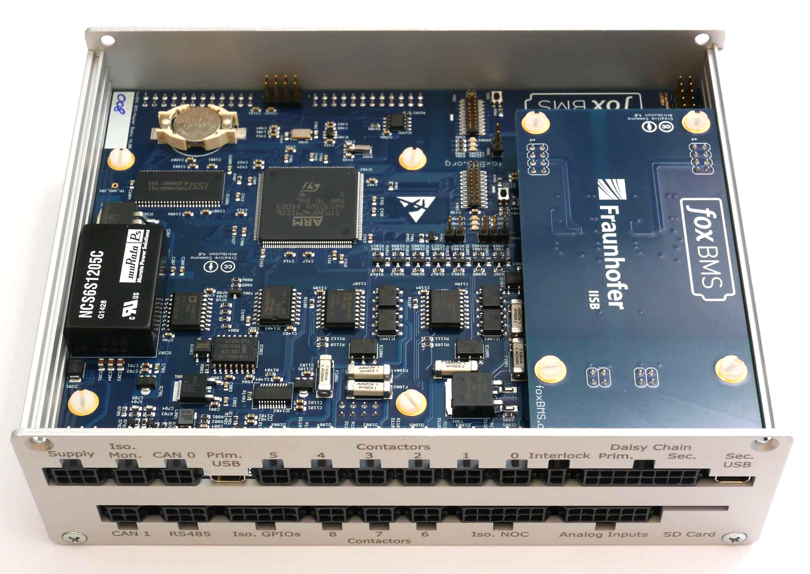
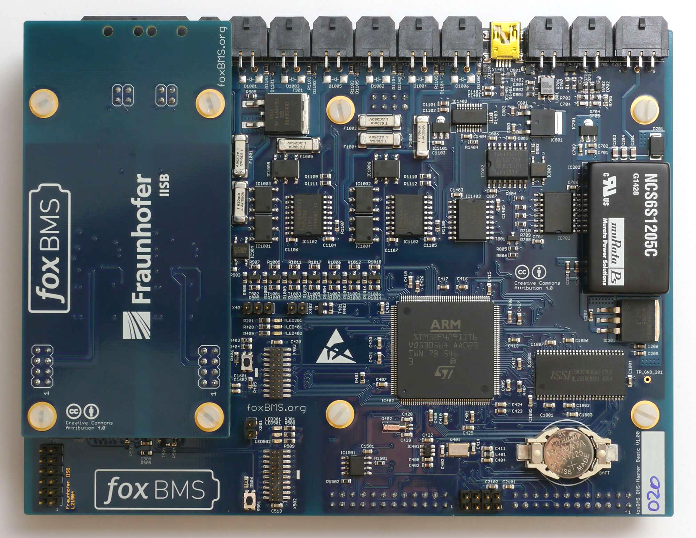
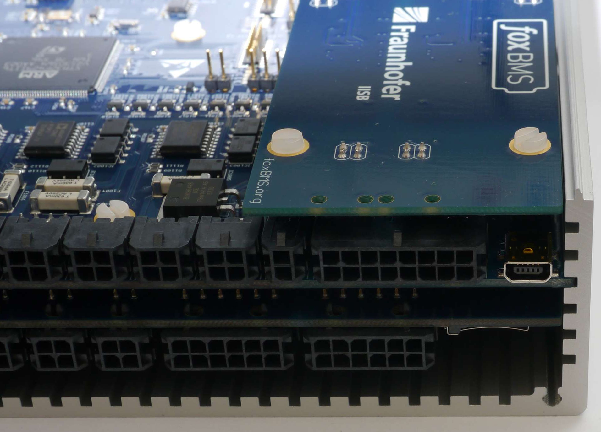
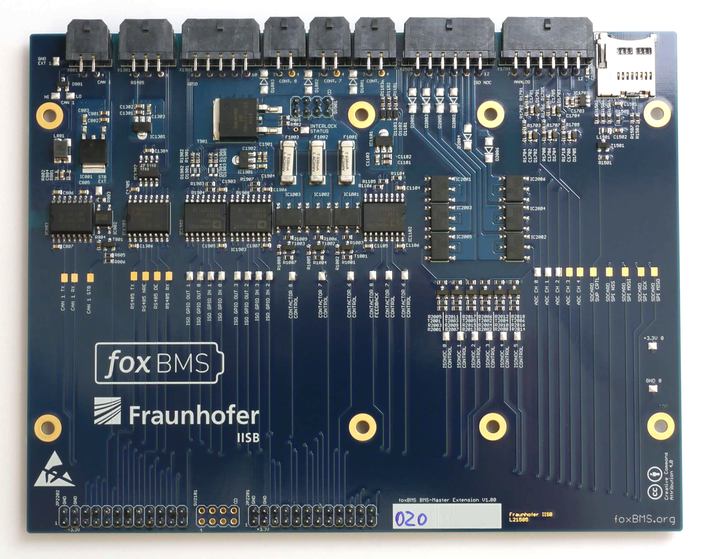
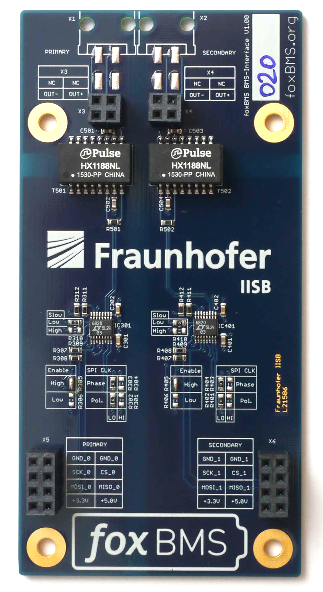
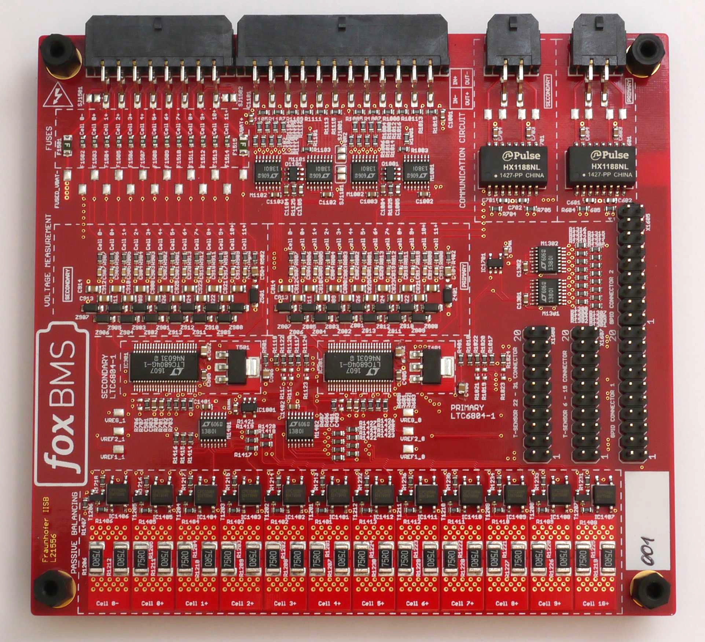

.. include:: ../macros.rst

.. _hw_quickstart_cables:

======================================================
Getting Started with the Hardware: Connecting |foxbms|
======================================================

In the preceeding sections, the |master| has been supplied and the |foxbms| firmware flashed on it.

This section describes the |foxbms| hardware in more details and how to connect the |master| to the |slaves| that perform the cell voltage and temperature measurements. The CAN communication is also described.

.. note::
   
      When the connection is made between the |master| and the |slaves|, both primary and secondary isoSPI daisy chains have to be connected.

----------------------------------
Convention for Connector Numbering
----------------------------------

:numref:`Fig. %s <connector_convention>` presents the convention for the connector numbering. It is used throughout
the documentation. 

.. _connector_convention:
.. figure:: ./_figures/2016-04-12_sixcon_view.png
   :width: 100 %

   Supply connector pin out, receptable - rear view, header - front view (image source: MOLEX)

There are two types of connectors:

 * Header
 * Receptable, plugged into the header
 
The numbering shown on the left in :numref:`fig. %s <connector_convention>` is always valid when viewing in the direction indicated by the arrow with the indication ``viewing direction``. This must be taken into account when crimping the receptables.
 
-------------------------------------------
Global Description of the |foxbms| Hardware
-------------------------------------------

The |foxbms| system can be mounted in a metal housing, shown in :numref:`fig. %s <housing>`.

.. _housing:
.. figure:: ./_figures/foxBMS_housing.jpg
   :width: 100 %
   
   |master| housing

In this configuration, the top plate can be removed to have access to the |foxbms| electronic boards. This is done by unscrewing the four screws holding the top plate.

The open housing is shown in :numref:`fig. %s <housing_open>`.

.. _housing_open:

   |master| housing, top plate removed

The boards can be removed from the housing. The boards without housing are shown in :numref:`fig. %s <foxbms_stack>`. To start, it is not necessary to remove the boards from the housing, but it is helpful to be able to look at the LEDs located on the |BMS-Master|.

.. _foxbms_stack:

   
   |foxbms| board stack removed from the housing (both |BMS-Master| and |BMS-Interface| are shown)

:numref:`Fig. %s <housing_detail>` shows how to put the boards back in the housing. 

.. _housing_detail:

   Introduction of the board stack in the |Master| housing

------------------------------------------
Detailed Description of the Hardware Parts
------------------------------------------

The heart of |foxbms| is the |BMS-Master|, shown in :numref:`fig. %s <foxbms_master>`.

.. _foxbms_master:
.. figure:: ./_figures/foxbms_master_basic_annotations.jpg
   :width: 100 %

   |foxbms| |BMS-Master|

As shown in :numref:`fig. %s <foxbms_master>`, the |BMS-Master| has two microcontroller units (MCU):

 - Primary (also called |MCU0|)
 - Secondary (also called |MCU1|)

Primary is the MCU where the |foxbms| software is run. The secondary MCU is present for redundant safety when developing software code on the primary MCU.

Each MCU has a set of LEDs, as shown in :numref:`fig. %s <foxbms_master>`:

 - Power LED
 - Red indicator LED
 - Green indicator LED

The power LED must lit when power is supplied to the |BMS-Master|, and the indicator LEDs should blink, except during flashing of software on the MCU.

If a debugger is used, it must be connected to the debug port (i.e., JTAG-interface) corresponding to the MCU being used. 

An extension board named |BMS-Extension| is present under the |BMS-Master| and is shown in :numref:`fig. %s <foxbms_extension>`).

.. _foxbms_extension:

   
   |foxbms| |BMS-Extension|

It is used to provide more I/O and interfaces than with the |BMS-Master| alone.

The |BMS-Interface| is located on top of the |BMS-Master| (shown in :numref:`fig. %s <foxbms_interface>`).

.. _foxbms_interface:

   
   |foxbms| |BMS-Interface|

Its purpose is to convert the signals sent by the Serial Peripheral Interface (SPI) of the |BMS-Master| to the first |BMS-Slave| in the daisy by using a proprietary isoSPI interface from Linear Technology.

A |BMS-Slave| is shown in :numref:`fig. %s <foxbms_slave>`.

.. _foxbms_slave:

   
   |foxbms| |BMS-Slave|

The |BMS-Slave| is based on the |LTC| battery cell monitoring chip. More information on the |LTC| integrated circuit can be found in the datasheet ([ltc_datasheet6804]_ and [ltc_datasheet6811]_). It supervises up to 12 battery cells connected in series. It performs voltage measurements, temperature measurements and passive cell balancing. In the daisy chain, the |BMS-Slaves| are connected via differential pair cables.

The |BMS-Slave| is not designed to be used in a specific housing.

A block diagram of a |BMS-Slave| is shown in :numref:`fig. %s <slave_diagram>`

.. _slave_diagram:
.. figure:: ./_figures/BlockDiagram.png
   :width: 100 %
   
   Block diagram of a |BMS-Slave|

-----------------------------------
Use of |foxbms| in a Battery System
-----------------------------------

:numref:`Fig. %s <hw_description>` present the organization of the hardware. The system consists of :math:`n` battery modules and :math:`m` |BMS-Slaves|. Each |BMS-Slave| is connected to a battery module, where it measures cell voltages and cell temperatures. The |BMS-Slaves| are connected in a daisy chain configuration: when a data package is sent to the daisy chain, it is first received by slave 1, which transmits it to slave 2 and so on until the data package is received by the last |BMS-Slave|.

.. _hw_description:
.. figure:: ./_figures/hw_system_overview.png
   :width: 100 %
   
   |foxbms| in the battery system

The |BMS-Interface| converts the messages sent by the |BMS-Master| so that they can be transmitted to the daisy chain and vice versa.

The |master| communicates with the Isabellenhuette current sensor IVT-MOD or IVT-S via CAN.

Communication with the control unit (for instance, a personal computer), is also made via CAN.

------------------------------------------------------
Hardware Setup of the |BMS-Master| and the |BMS-Slave|
------------------------------------------------------

:numref:`Fig. %s <foxbmsfront_quickstart>` presents all the connectors of the |BMS-Master|.
 
.. _foxbmsfront_quickstart:
.. figure:: ./_figures/2016-04-13_foxBMS_Front.png
   :width: 100 %
   
   Front view of the foxBMS Master, indicating the location of each header

The connectors needed for this quickstart guide are indicated in the following parts. 

Connecting the |BMS-Slave| to the |BMS-Master|
----------------------------------------------------------------------

.. note::
   
      When the connection is made between the |BMS-Master| and the |BMS-Slave|, two communication lines
      have to be connected: the primary and the secondary daisy chain.

The connector indicated as ``Daisy Chain`` in :numref:`fig. %s <foxbmsfront_quickstart>` must be used on the |BMS-Master|. Its layout is described in :numref:`table %s <master_daisy_connector>`.

.. figure:: ./_figures/2016-04-12_sixteencon.png
   :width: 30 %

.. _master_daisy_connector:

.. table:: |BMS-Master| Daisy Chain Connector

   ====   ====================== 
   Pin    Signal                    
   ====   ======================
   1      NC       
   2      OUT+ (Secondary |LTC|)  
   3      OUT- (Secondary |LTC|)  
   4      NC       
   5      NC       
   6      OUT+ (Primary |LTC|)    
   7      OUT- (Primary |LTC|)    
   8      NC                     
   9      NC                    
   10     NC                      
   11     NC                      
   12     NC                     
   13     NC                     
   14     NC                           
   15     NC                                    
   16     NC                               
   ====   ======================

.. note::
   This connector pin out is only valid for use of a foxBMS Master Interface board for the |LTC| monitoring IC. 

On the |BMS-Slave|, the connectors indicated as ``Primary Daisy Chain connector`` and ``Secondary Daisy Chain connector`` in :numref:`fig. %s <slave_diagram>` must be used. Their layout is described in :numref:`table %s <primary_daisy_connector>`.

.. figure:: ./_figures/2016-04-12_fourcon.png
   :width: 10 %

.. _primary_daisy_connector:

.. table:: Primary Daisy Chain Connector

   =============  ============
   Connector Pin  Daisy Chain
   =============  ============
   1              IN+ (Primary |LTC|)
   2              OUT- (Primary |LTC|)
   3              IN- (Primary |LTC|)
   4              OUT+ (Primary |LTC|)
   =============  ============

The OUT+ and OUT- pins of the |BMS-Master| go to the IN+ and IN- pins of the |BMS-Slave|.  A cable with a receptable on both ends must be crimped correctly to make the connection.

In case a second |BMS-Slave| must be connected to the daisy chain, the OUT+ and OUT- pins of the first |BMS-Slave| must be connected to the IN+ and IN- pins of the second |BMS-Slave|.

Cell Voltage Connector on the |slaves|
--------------------------------------------

The connector indicated as ``Battery cell connector (16 pin)`` in :numref:`fig. %s <slave_diagram>` has two purposes:
 * Supply of the slaveboard
 * Input of the cell voltages to the |LTC| monitoring chip

The layout of the connector is described in :numref:`table %s <cell_voltage_connector>`. Up to 12 battery cells can be connected in series, between VBAT+ and VBAT-. The |BMS-Slave| is supplied by VBAT+ and VBAT-. The total voltage of all cells in series must be between 11V and 55V (see [ltc_datasheet6804]_ and [ltc_datasheet6811]_). 0- correspond to the negative pole of cell 0, 0+ to the positive pole of cell 0, 1- correspond to the negative pole of cell 1, 1+ to the positive pole of cell 1 and so one till 11+, the positive pole of cell 11. As the cells are connected in series, the positive pole of one cell is connected to the negative pole of the next cell: 0+ to 1-, 1+ to 2+ and so on. The poles should be connected to the cell voltage connector as shown in :numref:`table %s <cell_voltage_connector>`.

If less than 12 battery cells are used, information on how to connect them can be found |LTC| datasheets ([ltc_datasheet6804]_ and [ltc_datasheet6811]_).

.. _cell_voltage_connector_layout:
.. figure:: ./_figures/2016-04-12_sixteencon.png
   :width: 30 %

.. _cell_voltage_connector:

.. table:: |BMS-Slave|, battery cell voltage connector

   =============  ============
   Connector Pin  Battery Cell
   =============  ============
   1              VBAT-
   2              0+ (1-)
   3              2+ (3-)
   4              4+ (5-)
   5              6+ (7-)
   6              8+ (9-)
   7              10+ (11-)
   8              NC
   9              0- 
   10             1+ (2-)
   11             3+ (4-)
   12             5+ (6-)
   13             7+ (8-)
   14             9+ (10-)
   15             11+
   16             VBAT+
   =============  ============

In case no cells are available, they can be simulated with a series of voltage divider. A voltage supplied of 30V should be used and 12 resistors with the same value connected in series between the positive and negative connectors of the voltage supply. The positive connector is linked to VBAT+, the negative connector to VBAT- and each pole of a resistor correspond to  a pole of a battery cell. The voltage of 30V  is chosen so that every simulated cell voltage lies around 2.5V, which lies in the center of the safe operating area defined by default in the |foxbms| software.

Cell Temperature Connector on the |slaves|
------------------------------------------------

The connector indicated as ``Temperature sensor connector (24 pin)`` in :numref:`fig. %s <slave_diagram>` is used to connect temperature sensors to the |BMS-Slave|.

:numref:`Table %s <cell_temperature_connector>` describes the temperature connector.

.. _cell_temperature_connector_layout:
.. figure:: ./_figures/2016-05-18_twentyfourcon.png
   :width: 45 %

.. _cell_temperature_connector:

.. table:: Temperature Sensor Connector

   =============  ==================
   Connector Pin  Temperature Sensor
   =============  ==================
   1, 24          T-Sensor 0
   2, 23          T-Sensor 1
   3, 22          T-Sensor 2
   4, 21          T-Sensor 3   
   5, 20          T-Sensor 4   
   6, 19          T-Sensor 5   
   =============  ==================

:numref:`Fig. %s <temp_sensor>` shows the functioning of a temperature sensor.

.. _temp_sensor:
.. figure:: ./_figures/temperature_sensor.png
   :width: 30 %

   Temperature sensor circuit.

The voltage VREF (3V) is generated by the |LTC| chip. A temperature-dependent resistor must be added to build a voltage divider (drawn as a dashed line in :numref:`fig. %s <temp_sensor>`, not delivered with the |BMS-Slaves|). The resulting voltage is measured by the |LTC| chip. Knowing the temperature dependence of the resistor, the relation between measured voltage and temperature can be determined.

A function is present in the code to make the conversion between measured voltage and temperature. It must be adapted to the temperature sensor used. This is described in the software FAQ (:ref:`sw_faq_temperature_sensors`). In case temperatures are read incorrectly, this function is the first step to verify.

It must be noted that if no sensor is connected, 3V are measured. For the quickstart guide, no sensor needs to be connected: the conversion function is simply a multiplication by 10, so 30°C will be displayed, which again lies in the center of the safe operating area defined by default in the |foxbms| software.

If sensors are added, they must be connected between the connector pins corresponding to the sensors 0 to 5, as shown in :numref:`table %s <cell_temperature_connector>`.

CAN Connector
-------------

The connector indicated as ``CAN 0`` in :numref:`fig. %s <foxbmsfront_quickstart>` must be used on the |BMS-Master|. Its layout
is described in :numref:`table %s <master_CAN>`.

.. figure:: ./_figures/2016-04-12_fourcon.png
   :width: 10 %

.. _master_CAN:

.. table:: Master CAN connection

   ====    =========    =============    ============
   Pin     Signal       Direction        Description
   ====    =========    =============    ============
   1       GND_EXT_0    Output
   2       NC           --
   3       CAN_0_L      Input/Output
   4       CAN_0_H      Input/Output
   ====    =========    =============    ============

Ground of |CAN0| is shared with supply ground GND_EXT_0. CAN  bus 0 is isolated from the |MCU0| via the isolated CAN transceiver TJA1052. The CAN transceiver may be put into standby mode by |MCU0|.

--------------------------------------
Communication with the |BMS-Master|
--------------------------------------

Once |foxbms| is running, CAN messages should be sent.

.. note::
   
      **A periodic state request must be made to the system by sending a message with ID 0x152 on the bus CAN periodically.**
      If not, the system will go into an error state. The period must be 100ms.
      More information on state requests can be found in the section :ref:`CAN_communication`.
      Typically the request "Standby state" can be made.

If voltages have been applied to the voltage connector, they are sent with the message IDs 0x550, 0x551, 0x552 and 0x553. Details can be found in the section :ref:`CAN_communication`.

If temperature sensors have been connected and the conversion function changed in the software, temperature are sent with the messages with IDs 0x353 and 0x354. Details can be found in the section :ref:`CAN_communication`.

----------------------------
Current Sensor Configuration
----------------------------

Further information on the current sensor tested with |foxbms| can be found in the `datasheet of the current sensor <http://www.isabellenhuette.de/uploads/media/IVT_Modular_datasheet_1.20_02.pdf>`_. To be used in |foxbms|, the current sensor IVT-MOD from Isabellenhütte was reprogrammed. The changes compared to factory default are:

 * The CAN Message IDs was changed
 * The triggered measurement mode was activated

The two following parts sum up the differences between factory setup and |foxbms| setup.

Factory Default
---------------

* CAN IDs

  * 0x411 (dec: 1041) Command 
  * 0x521 (dec: 1313) Current Measurement
  * 0x522 (dec: 1314) Voltage Measurement 1
  * 0x523 (dec: 1315) Voltage Measurement 2
  * 0x524 (dec: 1316) Voltage Measurement 3
  * 0x511 (dec: 1297) Response

* Measurement Mode: Cyclic (Disabled and Triggered are other possible modes)

After Configuration
-------------------

* CAN IDs

  * 0x35B (dec: 859) Command
  * 0x35C (dec: 860) Current Measurement
  * 0x35D (dec: 861) Voltage Measurement 1
  * 0x35E (dec: 862) Voltage Measurement 2
  * 0x35F (dec: 863) Voltage Measurement 3
  * 0x7FF (dec: 2047) Response

* Measurement Mode: Triggered

-------------------------------------------
Hardware Related Frequently Asked Questions
-------------------------------------------

Are the schematic and layout source files available?
----------------------------------------------------

Yes, the complete |foxbms| schematic and layout files are available in EAGLE format in the HTML documentation in the section :ref:`hw_layout_schematic`.

Have both primary MCU and secondry MCU to be connected?
-------------------------------------------------------

Yes, they should always tbe connected and configured to provide redundant monitoring and improved safety during software development in prototyping applications.

.. [ltc_datasheet6804] LTC6804 Datasheet http://cds.linear.com/docs/en/datasheet/680412fb.pdf
.. [ltc_datasheet6811] LTC6811 Datasheet http://cds.linear.com/docs/en/datasheet/68111f.pdf
