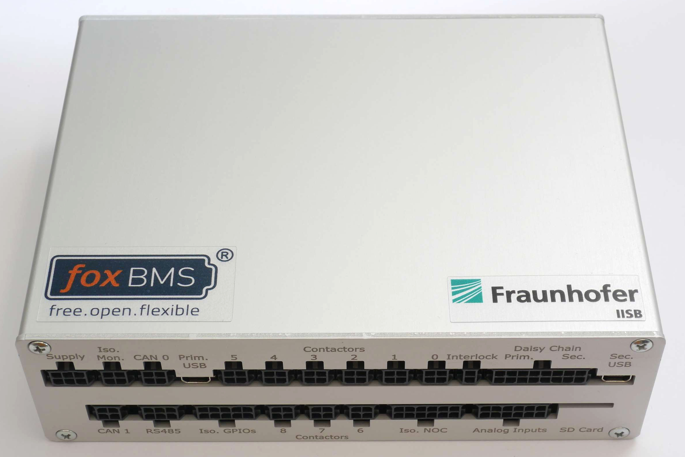
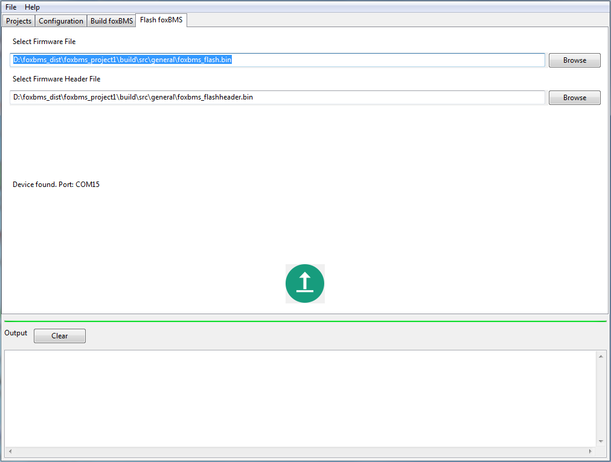
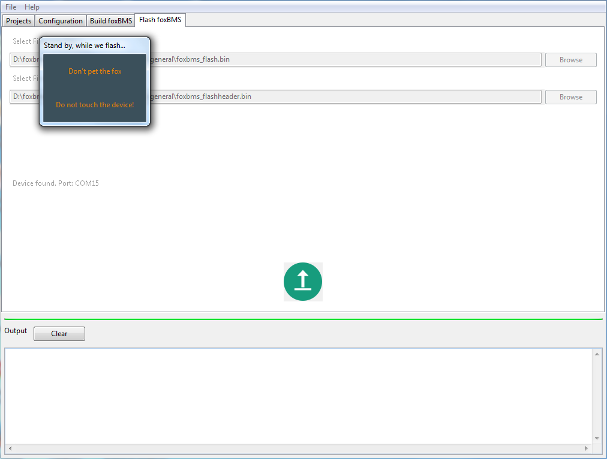

.. include:: ../macros.rst

.. _hw_quickstart_flash:

=============================
Getting Started with Flashing
=============================

This section describes how to supply the |master| in order to flash compiled sources.

This section shows how to connect the different parts of the |foxbms|.

----------------------------------
Convention for Connector Numbering
----------------------------------

:numref:`Fig. %s <connector_convention_flash>` presents the convention for the connector numbering. It is used throughout
the documentation. 

.. _connector_convention_flash:
.. figure:: ./_figures/2016-04-12_sixcon_view.png
   :width: 100 %

   Supply connector pin out, receptable - rear view, header - front view (image source: MOLEX)

There are two types of connectors:

 * Header
 * Receptable, plugged into the header
 
The numbering shown on the left in :numref:`fig. %s <connector_convention_flash>` is always valid when viewing in the direction indicated by the arrow with the indication ``viewing direction``. This must be taken into account when crimping the receptables.
 

-----------------------------------------------------
Hardware Setup of |master| and |slaves|
-----------------------------------------------------

The foxBMS system can be mounted in a metal housing, as shown in :numref:`fig. %s <housing_flash>`.

.. _housing_flash:

   
   |master| housing

Connectors are available, shown in :numref:`Fig. %s <foxbmsfront_quickstart_flash>`, which presents all the connectors of the |master|.
 
.. _foxbmsfront_quickstart_flash:
.. figure:: ./_figures/2016-04-13_foxBMS_Front.png
   :width: 100 %
   
   Front view of the foxBMS Master, indicating the location of each header

For this section on flashing, only the connector "Supply" is needed. 

-----------------------------
Supply of the |master|
-----------------------------

The first step is to supply the |master|, which works with supply voltages between 12 and 24V DC. To supply the |master|, a connector must be prepared for the ``Supply`` connector as shown in :numref:`table %s <master_supply_connector>`, which describes the different pins used.

.. _sixcon_view:
.. figure:: ./_figures/2016-04-12_sixcon.png
   :width: 10 %

.. _master_supply_connector:

.. table:: |BMS-Master| Supply Connector

   ====   =============    ============    ============   
   Pin    Signal           Input/Output    Description
   ====   =============    ============    ============   
   1      SUPPLY_EXT_2     Input           12 - 24V 
   2      SUPPLY_EXT_2     Input           12 - 24V
   3      GND_EXT_2        Input           GND
   4      SUPPLY_EXT_0     Input           12 - 24V
   5      GND_EXT_0        Input           GND
   6      GND_EXT_2        Input           GND
   ====   =============    ============    ============

The supply is separated as follows:

 - With pins SUPPLY_EXT_0 and GND_EXT_0, the microcontroller and the isolation devices are supplied 
 - With SUPPLY_EXT_2 and GND_EXT_2, the contactors and the interlock are supplied 

To power up the |master|, plug in the supply connector and apply a voltage between 12 and 24V. SUPPLY_EXT_0 / GND_EXT_0 and SUPPLY_EXT_2 / GND_EXT_2 may be connected to the same source for this initial test. At this point, the |master| should draw approximately 150mA at 12V or 110mA at 24V.

-------------------------
Primary and Secondary MCU
-------------------------

The |BMS-Master| has two MCUs: primary (|MCU0|) and secondary (|MCU1|). The secondary MCU is present to ensure redundant safety especially in prototyping applications.

First, the primary MCU will be flashed.

In order to program the primary MCU, the mini USB jack indicated as ``Prim. USB`` in :numref:`fig. %s <foxbmsfront_quickstart_flash>` must be used to connect the |master| to a PC. The |master| can be connected to a PC immediately. When connecting |master| for the first time, the required drivers will install automatically. After the drivers have been installed, the USB cable should be disconnected from the computer before going on with the quickstart guide.

.. note::
   
      Before the connection is made between the |master| and the computer for the first time, the computer must be connected to the internet, because the operating system might look for drivers on the internet. It this fails, administrators right are needed to install the driver.

In case of problems by the installation of the drivers, administrator rights might be needed. Once the hardware is supplied, the |foxbms| binaries can be flashed. 

The same procedure must be made for secondary: the mini USB jack indicated as ``Sec. USB`` in :numref:`fig. %s <foxbmsfront_quickstart_flash>` must be used to connect the |master| to a PC. As for the primary MCU, the PC must be connected to the internet before the connection is made with the |master|.

---------------------------------------------
Flash the Compiled Source for the Primary MCU
---------------------------------------------

In the section :ref:`sw_quickstart`, the |foxbms| sources have been compiled and the generated binary is ready to be flashed. As the archive |primary archive| was used, the sources are made for the |MCU0|: the |MCU0| will be flashed first.

These binaries are needed: 

 1. a binary file with the header and 
 2. a binary file with the main code. 

Unless the build process has been altered or different binaries should be flashed, there is no need to change the default file locations.

For the quickstart, the default file locations are used.

First, when no device is connected, ``No device found.`` is displayed, as shown in :numref:`fig. %s <frontdesk_figure5>`. The flash button is deactivated.

.. _frontdesk_figure5:
.. figure:: ./_figures/frontdesk5.png
   :width: 100 %

   Flashing tab, no device connected

The device must be connected to the computer with the USB cable. The |MCU0| must be used. In the :ref:`hw_quickstart_cables`, it is explained how to find the |MCU0| and where the primary USB connector is located.

Once a device was connected and detected, ``Device found.`` is displayed and the flash button becomes active, as shown in :numref:`fig. %s <frontdesk_figure6>`.

.. _frontdesk_figure6:

   Flashing tab, device connected
 
When the flash button is clicked, a windows appears, reminding not to touch the device that is being flashed, as shown in
:numref:`fig. %s <frontdesk_figure7>`.

.. _frontdesk_figure7:

   Flashing tab, device connected, flashing

The connection state can also be checked by watching the LEDs on the |master| hardware: for a running board, the green power LED is on, and the two indicator LEDs (green and red) are blinking alternately. If the device is connected and being flashed, the power-on LED is on but the two indicator LEDs are off.

The LEDs for the |MCU0| must be used. In the :ref:`hw_quickstart_cables`, it is explained how to find the |MCU0| indicator LEDs.

.. note::

   After connecting the device and before flashing, if clicking on the flash button has no effect even if ``Device found.`` is displayed,
   disconnecting and connecting the device should solve the problem.

When the flashing is complete, the flashing windows disappears and the
indicator LEDs start to blink again.

Under Windows 7 (64 bit),it can happen that the COMPORT number is increased by Windows, leading to problems during flashing. This can be reset in registry, by setting ``ComDB`` to zero in the entry ``HKEY_LOCAL_MACHINE::SYSTEM::CURRENT_CONTROL_SET::CONTROL::COM NAME ARBITER``. This way, all COM ports used are reset.

---------------------------
Flashing the Secondary MCU
---------------------------

A source code archive is provided to flash the secondary MCU, called |secondary archive|. The same procedure as explained above must be followed with this archive, with the following differences:

 * A second project must be created in the IDE
 * The secondary MCU must be flashed with the USB connector corresponding to secondary. 

With the supplied code, the |MCU1| checks the temperatures and voltages. If one or more of the values are outside the limits, the |MCU1| opens the interlock line (thus opening the contactors). The interlock line remains open until the |MCU1| is reset.

Before the flashing procedure, the limits can be set via the configuration page of the graphical user interface, as shown previously.

.. note::

   Setting these limits is safety relevant and must be done with care.
   
If the user wishes to work without these protection, to experiment more easily, this can be changed in the file `bmsctrl_cfg.h` by setting

.. code-block:: C

    #define BMSCTRL_TEST_CELL_LIMITS TRUE

to

.. code-block:: C

    #define BMSCTRL_TEST_CELL_LIMITS FALSE
   
.. note::

   **Working without configuring the right battery cell voltage limits is dangerous and should never be done when real batteries are connected, since they may burn and explode when overcharged or shorted.**
   
The next step is to connect a |slave| to perform voltage and temperature measurement.

---------------------------------------
Debugging the Primary and Secondary MCU
---------------------------------------

The following two debuggers can be used for debugging foxBMS and are used by the foxBMS team.

 * `Segger J-Link Plus <https://www.segger.com/j-link-plus.html>`_, with the `19-Pin Cortex-M adapter <https://www.segger.com/jlink-adapters.html#CM_19pin>`_ (needed to connect to foxBMS)
 * `Lauterbach µTrace Debugger for Cortex-M <http://www.lauterbach.com>`_
  

