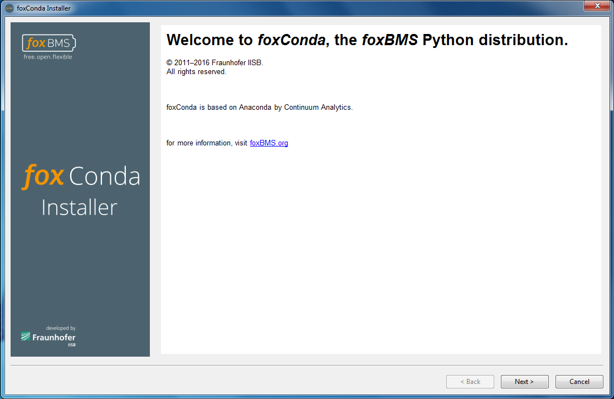
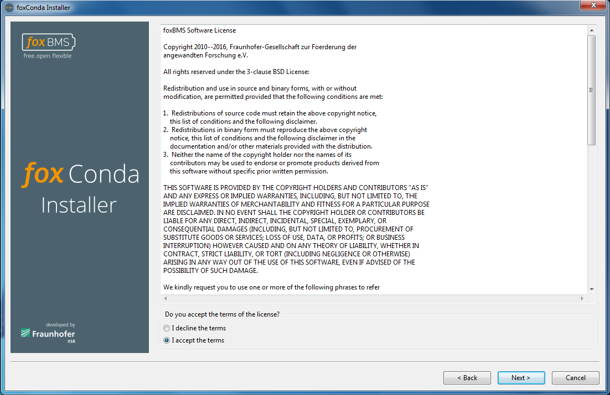
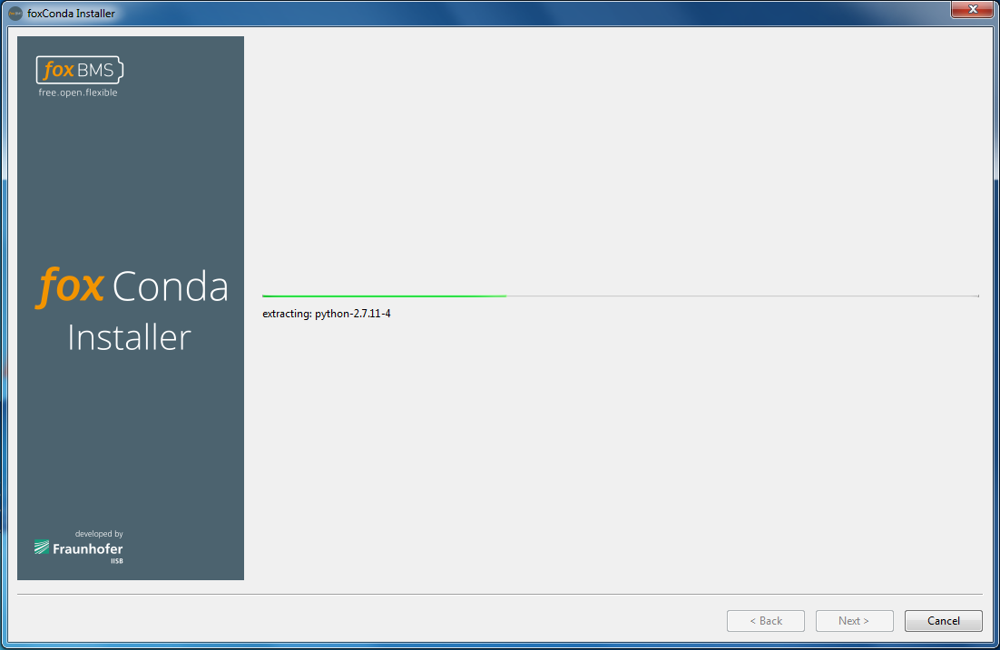
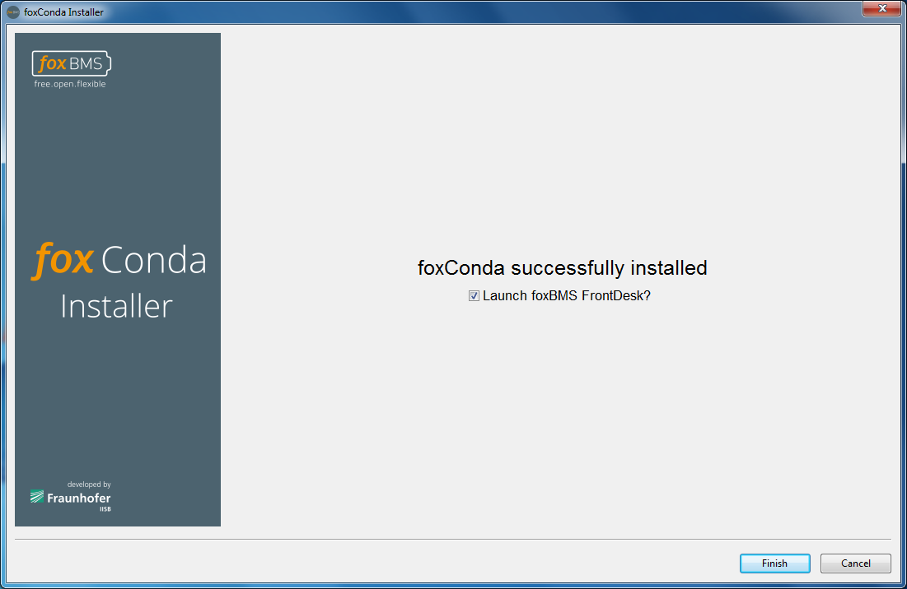
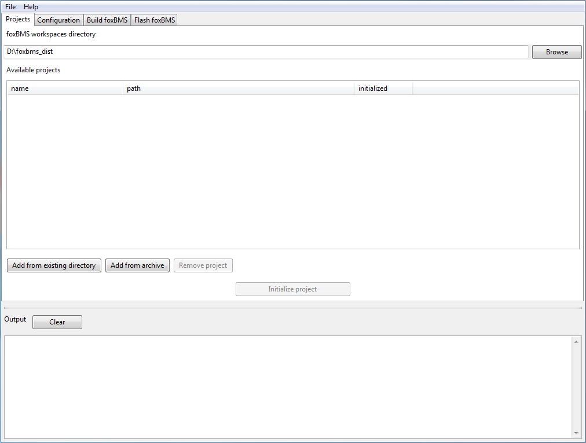
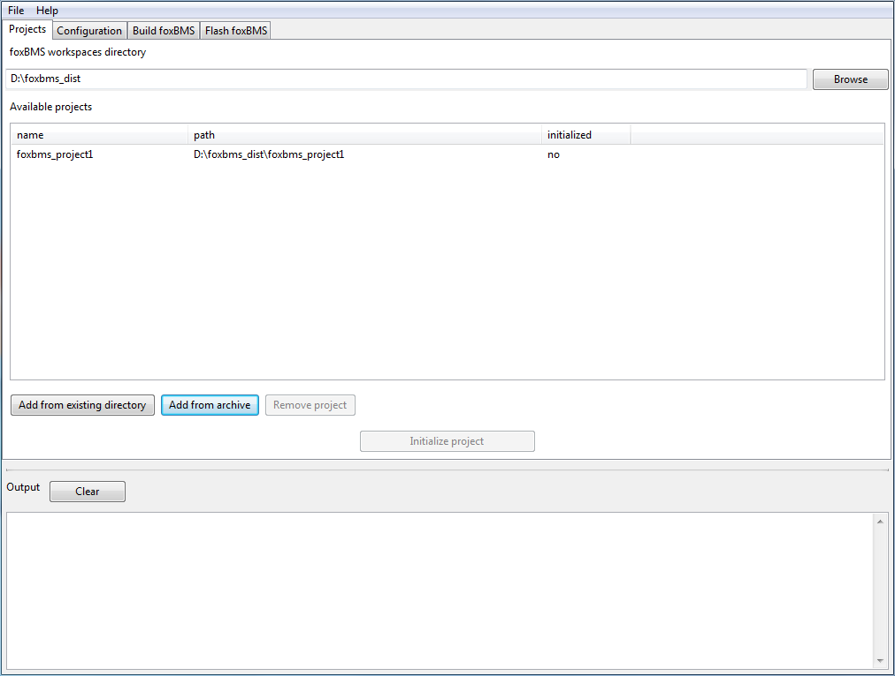
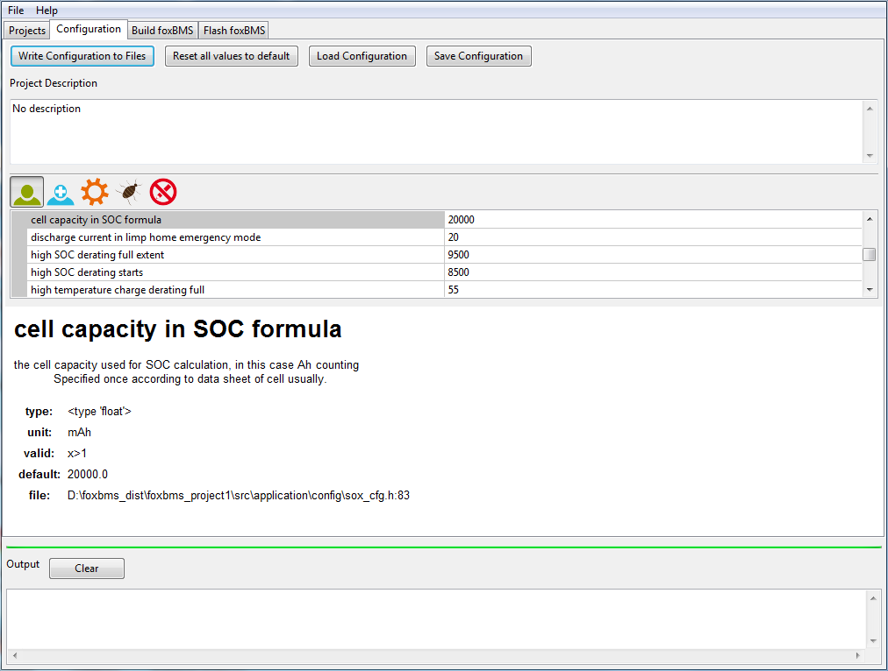
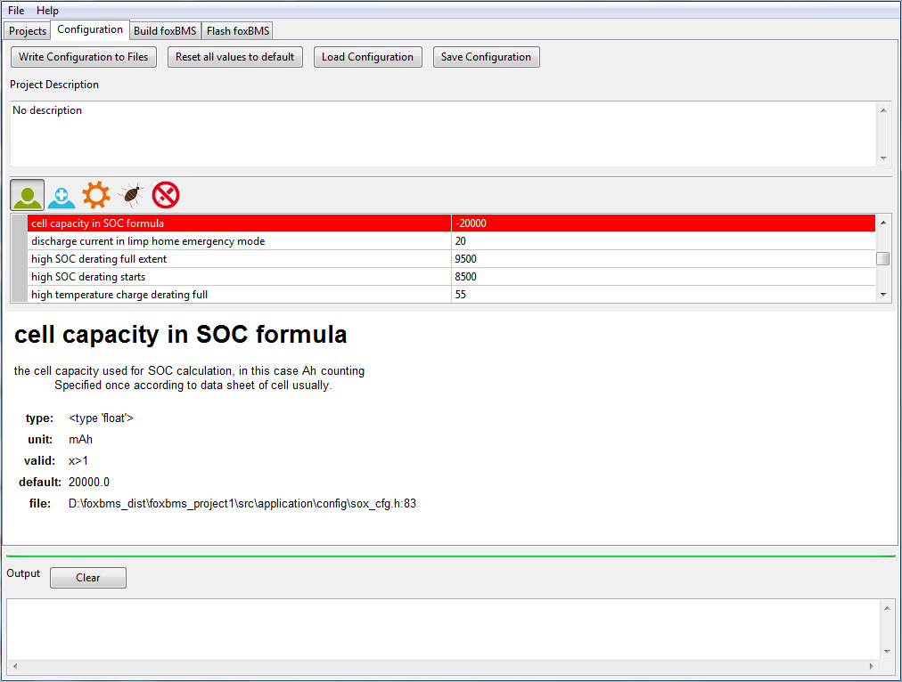
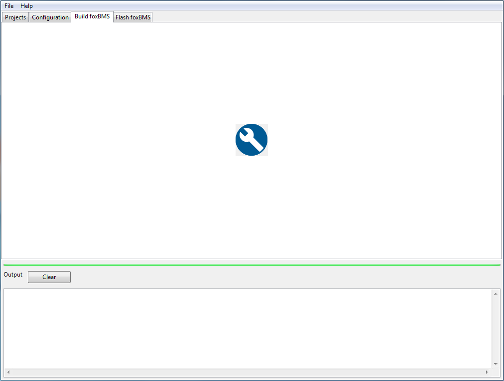

.. _sw_quickstart:

=================================
Getting Started with the Software
=================================

.. include:: ../macros.rst

The |foxBMS| software consists of a program written in C. Before it can be flashed and run on the microcontroller unit (MCU),
it must be compiled to generate a binary file.

Different softwares (the software toolchain) are needed for this compilation step. They are based on a Python environment.
All the needed software, including the Python environment, are contained in a Python distribution called **foxConda**.
It will be installed in the next step. 

In addition, some parameters can be adjusted in the sources before compilation, to change the behavior of the software.
A graphical environment is provided to simplify all theses tasks
(configuration, compilation, flashing).

This section shows how to (1) set up the development environment,
foxConda (the software toolchain), (2) launch the graphical development tool, (3) configure the
|foxBMS| source, (4) compile it. 

In a dedicated section (:ref:`hw_quickstart_flash`) the compiled sources are flashed on the |foxBMS| hardware.

-----------------------------------------------------------------
Installation of the needed software via the foxConda distribution
-----------------------------------------------------------------

The first step is to install the software environment needed to compile and
flash the |foxBMS| sources. First, the foxConda installer must be run by executing
|installer archive|.

The window shown in :numref:`fig. %s <condainstaller1>` will appear. 

.. _condainstaller1:

   Installer start page

On this window, the |foxBMS| webpage can be accessed by clicking on the link in blue.

Then by clicking on ``Next >`` the license shown in :numref:`fig. %s <condainstaller2>` is displayed.

.. _condainstaller2:

   
   Installer license terms

To continue, the license terms must be accepted (check ``I accept the terms``) before
clicking on ``Next >``.

An installation directory must be selected :numref:`fig. %s <condainstaller3>`.

.. _condainstaller3:

   
   Installation path for the Front Desk environment

A default location is proposed, which can be changed. Clicking
on ``Next >`` starts the installation as shown in 
:numref:`fig. %s <condainstaller4>`. This step can take several minutes.

.. _condainstaller4:

   
   Installation progress

The login credentials may be asked to generate start menu and
desktop shortcuts for the development tools.

Once the installation is complete, the message shown in :numref:`fig. %s
<condainstaller5>` appears.

.. _condainstaller5:

   
   Installation end

Here, it can be chosen to launch the foxBMS Front Desk—the graphical
user interface that configures, builds and flashes the software—immediately
after finishing the installation.

If shortcuts were created, they can be used to start the Front Desk or a
terminal environment.

To start the Front Desk manually, it must be navigated to the ``FOXCONDA\Scripts``
directory, where ``FOXCONDA`` is the installation directory of the
foxConda distribution, for example, ``C:\Users\Me\foxconda``. After the
program, called ``foxbms.exe`` was found, a double click on it will launch it.

In addition, if it is preferred to build foxConda from the command line,
the convenience terminal environment can be used by executing ``fbterminal.exe``,
which is also located under ``FOXCONDA\Scripts``. It will open a CMD window
with a PATH environment ready to configure, compile and flash |foxBMS|.

-------------------------------------------------------------------------
Configuration, Compilation and Flashing with the Graphical User Interface
-------------------------------------------------------------------------

The |foxBMS| configuration and flash IDE is started with ``foxbms.exe`` as
described in the previous section.

When the program starts, a terminal window appears. This is normal.
It will dissapear when the program is closed.

Select the sources
================== 

The IDE starts with the source selection tab shown in :numref:`fig. %s <frontdesk_figure1>`.

.. _frontdesk_figure1:

   Project selection tab

A project corresponds to the |foxBMS| source code tree located on the computer. A folder must be created were
the projects will be stored. First, the ``foxBMS workspaces directory`` must be clicked on to select the folder
that was created, under which all the new |foxBMS| projects will be
placed. Next, the latest |foxBMS| release source code archive must be fetched and placed
at a convenient folder. Clicking on the ``Add from archive`` button
allows opening the archive. The archive must not be extracted, this is done by the IDE.
For the quickstart guide, the archive is called |primary archive|.
The source tree will be extracted into the workspace
directory, and the project will be added to the list of available projects,
as shown in :numref:`fig. %s <frontdesk_figure2>`.

.. _frontdesk_figure2:

   Project selection tab, one project added

An existing source tree directory can also be added, which, for example, has been manually unpacked.
The button ``Add from existing directory`` must be used. 
The folder will not be copied to the workspace directory. It will only
be linked to the list of available directories. This possibility is not used in the quickstart guide. 

.. _html_docu_generation:

Generate complete HTML documentation and code reference
=======================================================

To proceed, the documentation must be generated.
A project from the ``Available projects`` list must be selected by clicking on it. The project
that has just been created must be selected. It will be highlighted in the list. Then
it must be initialized by clicking on ``Initialize project``. During the
initialization, the project is configured for the current development
environment, and the documentation is generated, including the complete HTML documentation and the code reference.
Once generated, the documentation can be accessed fronm the interface in the ``Help menu``.
The HTML complete documentation can be accessed directly by pressing ``F1``, too.

During initialization, some terminal windows may open. They will close automatically. 
It must be noted that the last column in the projects list shows if a project has been
successfully initialized. A project can always
be re-initialized, for example, if the foxConda
environment has been upgraded or the documentation modified. For an already initialized
project, the initialization button reads ``Re-initialize project``.

The result of the initialization procedure is displayed in the ``Output``
area. The ``Clear`` button can be pressed to clean the output sub-window.

Configure the Code
==================

After the selected project has been initialized, it can be proceeded to the
``Configuration`` page, shown in :numref:`fig. %s <frontdesk_figure3>`. 

.. _frontdesk_figure3:

   Configuration tab

It must be noted that selecting the configuration page is not possible as long as
the selected project is not initialized. 

The different areas of the window can be resized with the mouse. For instance, it
is useful to make the property area bigger for a better visibility.

The behavior of |foxBMS| can be adapted to the requirements and needs through a
number of configuration variables. For that purpose, a
configuration method called Foxygen was developed. Configuration variables are
qualified within the source through annotations. The configuration engine
displayed on this page compiles a list of such variables and displays them. 
This may take a few seconds.

The properties are divided into five different categories that can be
selected by clicking on the respective icon:

 1. User: standard configuration for the BMS (e.g., number of battery
    modules, number of cells per module, battery cell capacity)
 2. Advanced: advanced configuration for the BMS (e.g., clock timings) 
 3. Devel: configuration for user modifying the source code
 4. Debug: configuration needed for user debugging the source code 
 5. Read-only: parameters shown as information

Underneath the property list, a description for each item can be found.
Different types of parameters can be distinguished: 

 - Numeric value (integer of floating point number)
 - True or False
 - Activated or deactivate 
 - A list of options

If the property expects a numerical value, a range of validity is typically
given. It can be found in the description window. If a
value outside of the permitted range is entered, the entry appears in red, as shown
in :numref:`fig. %s <frontdesk_figure3a>`. 

.. _frontdesk_figure3a:

   Configuration tab, incorrect parameter value

:numref:`Fig. %s <frontdesk_figure3b>` shows an example for a list of options to
choose from.

.. _frontdesk_figure3b:
.. figure:: ./_figures/frontdesk3b.png
   :width: 100 %

   Configuration tab, multiple choice parameter

To modify the sources according to the configuration settings, the ``Write Configuration to Files``
button must be pressed. The modifications will be lost if another page is selected
without pressing ``Write Configuration to Files``. The default values of all
parameters can be restored by the ``Reset all values to default`` button. 

.. note::

   The ``Write Configuration to Files`` button must also be pressed after a reset,
   to proceed building an unmodified |foxBMS| instance.

The current configuration can be saved (no matter if it was written to the
source files or not) by clicking on ``Save Configuration``. To restore a
previously saved configuration, ``Load Configuration`` must be chosen. It is important
not to forget to select ``Write Configuration to Files``. For the quickstart, it is
not necesary to use this save/load feature.

Build Configured Sources
========================

After configuration, the firmware can be build by proceeding to the next
page ``Build foxBMS`` (see :numref:`fig. %s <frontdesk_figure4>`). There 
the ``Build foxBMS`` button must be pressed.

.. _frontdesk_figure4:

   Build tab

During the build process, some terminal windows may open. They will close automatically.

The result of the compilation can be found in the ``Output`` pane.

The next step is to flash the sources on the |foxBMS| hardware. 

Software Related Frequently Asked Questions
===========================================

Where are the sources?
----------------------

Once a |foxBMS| archive has been imported in Front Desk, they are automatically extracted and copied on disk.

What libraries and programs must be installed?
----------------------------------------------

None, because they are installed with the foxConda installer.
 