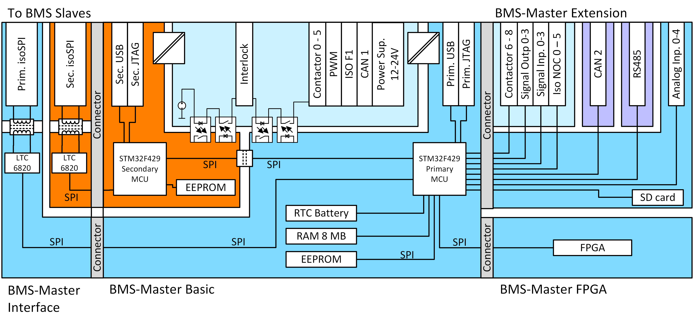
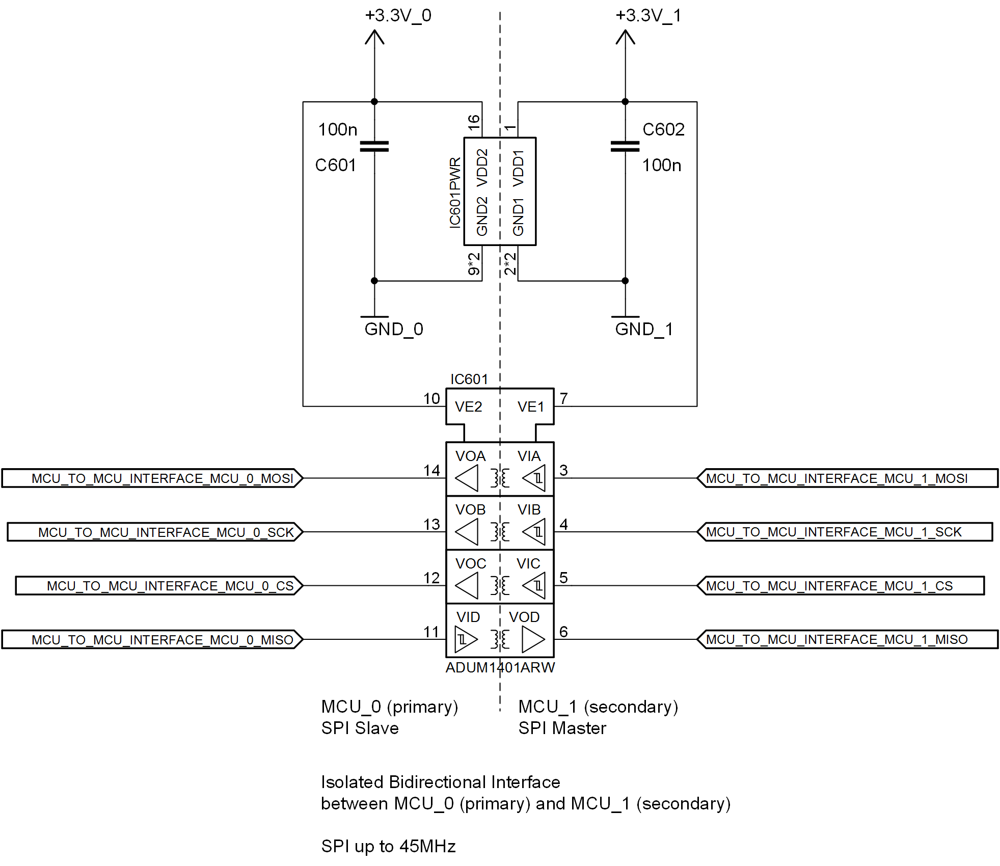
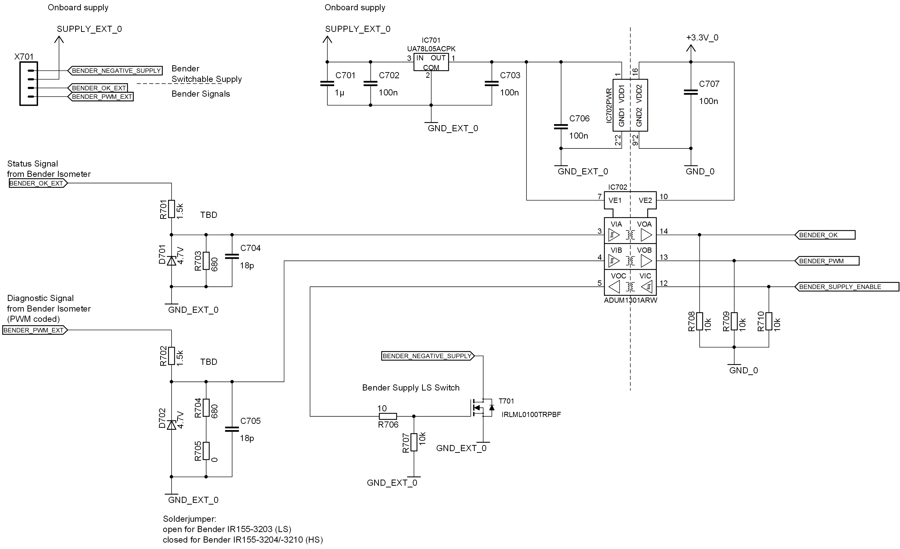
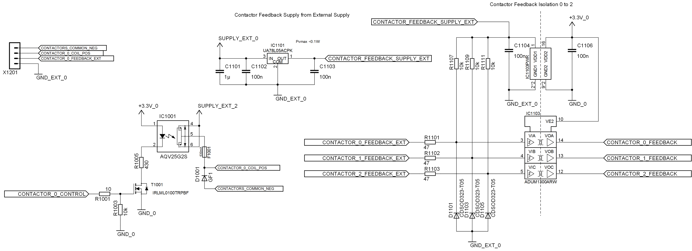
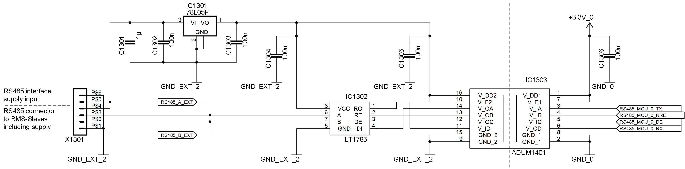
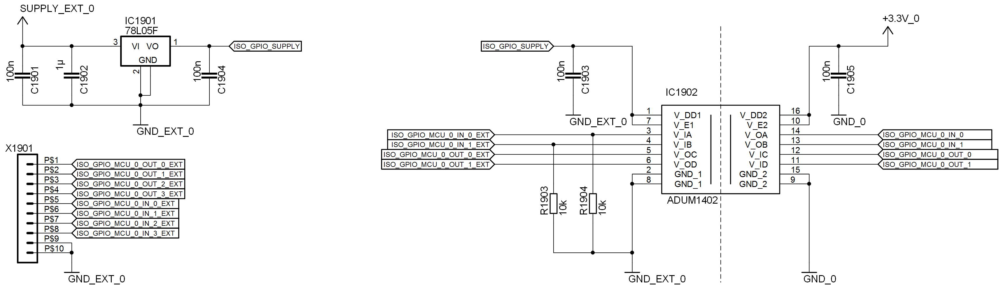
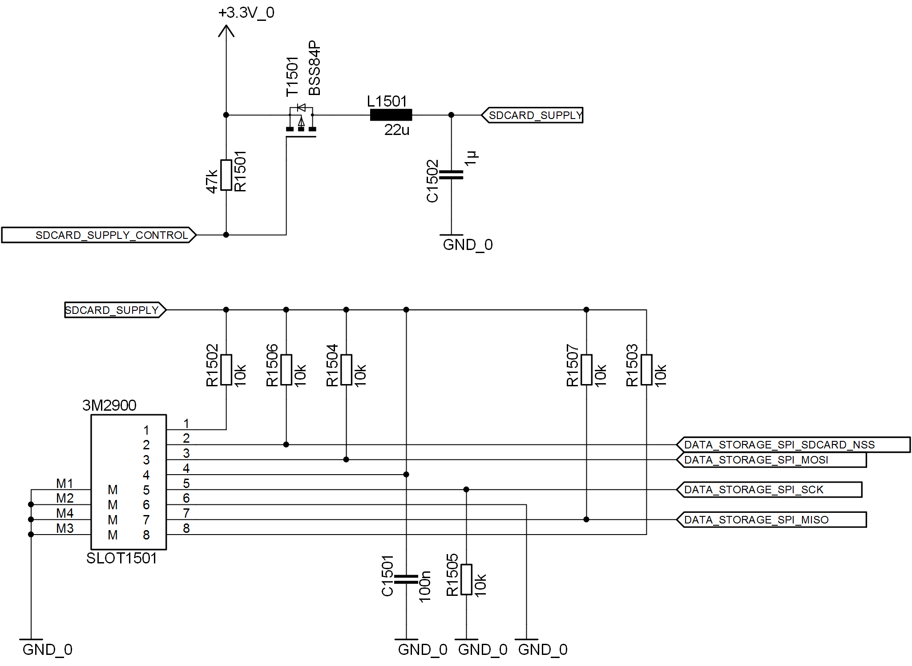

.. include:: ../../macros.rst

.. _hw_basics:

====================
Hardware Description
====================

This part of the documentation describes the hardware modules used in |foxbms|.
:numref:`Fig. %s <hwblockdiagram>` shows a block diagram of the |BMS-Master| with all its components.

.. _hwblockdiagram:

   
   |BMS-Master| hardware block diagram

Supply 0 (|primary|)
--------------------

.. _supplyzero:
.. figure:: ./_figures/2016-04-14_SUPPLY_0.png
   :width: 100 %
   
   Supply for all circuit parts related to the |primary| part of |foxbms|

The external supply for the |BMS-Master| is divided in a part supplying the interlock circuit, the contactors (SUPPLY_EXT_2), and the rest of the circuit (SUPPLY_EXT_0) as shown in :numref:`Fig. %s <supplyzero>` . The |Master| can be supplied with a voltage between 12V and 24V DC. The |primary| part of the |foxbms| is isolated from SUPPLY_EXT_0 by an isolating DC/DC converter (IC202). The 5V output of the DC/DC converter is stepped down to 3.3V by an LM1085 LDO (IC201). The output of IC201 (+3.3V_0) supplies the |primary| microcontroller |MCU0| and the related circuits.

Supply 1 (|secondary|)
----------------------

.. _supplyone:
.. figure:: ./_figures/2016-04-14_SUPPLY_1.png
   :width: 100 %
   
   Supply for all circuit parts related to the |secondary| part of |foxbms|

The |secondary| part of |foxbms| is also supplied by SUPPLY_EXT_0 as shown in :numref:`Fig. %s <supplyone>`. Also the |secondary| part of the |BMS-Master| is isolated from SUPPLY_EXT_0 by an isolating DC/DC converter (IC302). The 5V output of the DC/DC converter is stepped down to 3.3V by an LM1085 LDO (IC301). The output of IC301 (+3.3V_1) supplies the |secondary| microcontroller |MCU1| and the related circuits.

|MCU0| (|primary|)
------------------

.. _mcuzerobootrst:
.. figure:: ./_figures/2016-04-14_MCU_0_BOOT_RST.png
   :width: 100 %
   
   Boot and reset circuit for the |primary| microcontroller

:numref:`Fig. %s <mcuzerobootrst>` shows the boot and reset related circuits of the |primary| microcontroller |MCU0|. |MCU0| can be manually reset by push button S401. Please note that the housing has to be opened to reach S401, therefore resetting |MCU0| by means of S401 is intended for use in a laboratory setting/debugging situation. 

.. _mcuzeroadcref:
.. figure:: ./_figures/2016-04-14_MCU_0_ADC_REF.png
   :width: 100 %
   
   ADC reference voltage for the |primary| microcontroller

The ADCs of the |primary| microcontroller |MCU0| are supplied with a 2.5V reference voltage provided by an ADR3425 (IC401) as shown in  :numref:`Fig. %s <mcuzeroadcref>`.
   
.. _mcuzeroosc:
.. figure:: ./_figures/2016-04-14_MCU_0_OSC.png
   :width: 100 %
   
   Clock circuits of the |primary| microcontroller
   
The |primary| microcontroller |MCU0| is clocked by an 8MHz oscillator as shown in :numref:`Fig. %s <mcuzeroosc>`. An separate oscillator (Q402) is used to clock the RTC (real time clock) integrated in |MCU0|.

Interface between |MCU0| and |MCU1|
-----------------------------------

.. _mcumcuif:

   
   Interface between |primary| and |secondary| microcontroller

Besides being linked over the common interlock line, the |primary| and |secondary| microcontroller also have a common SPI data interface. The |secondary| microcontroller |MCU1| acts as the master in the SPI communication. The interface is isolated using an ADUM3401 as shown in :numref:`Fig. %s <mcumcuif>`.
 
Interface to Bender ISOMETER
----------------------------
.. _bender:

   
   Interface to the Bender ISOMETER

The |BMS-Master| supports Bender ISOMETER IR155-3203/-3204/-3210. Two inputs are provided: one for a PWM coded diagnostic signal and one for a simple status signal (OK or NOK) as shown in :numref:`Fig. %s <bender>`. The Bender ISOMETER is supplied SUPPLY_EXT_0 and may be switched on or off (lowside) by the |BMS-Master|. The input signals are limited to  level of 5V with Zener diodes D701 and D702. In order adapt the interface for use with a IR155-3204/-3210 device, the solder jumper R705 has to be removed. The input signals are isolated from the microcontoller by an ADUM3301 (IC702).

|CAN0|
------

.. _can:
.. figure:: ./_figures/2016-04-14_CAN_0.png
   :width: 100 %
   
   Circuit of the CAN interface (|CAN0|) 

The |CAN0| interface is intended to connect additional sensors, such as the Isabellenhütte IVT-MOD-300 current sensor to the |master| and the |master| to other devices such as a test bench control unit or an HMI unit. The circuit in :numref:`Fig. %s <can>` shown the input circuit consisting of protection diode D801, common mode choke L801, C804, and termination resistors R801 and R802. The CAN transceiver TJA1052 provides isolation and can be put to sleep by the |primary| microcontroller |MCU0| via an CPC1008N optocoupler (IC803). The external part of the |CAN0| interface is supplied by SUPPLY_EXT_0.

Interlock
---------

.. _interlock:
.. figure:: ./_figures/2016-04-14_INTERLOCK.png
   :width: 100 %
   
   Interlock circuit 

The |primary| and |secondary| microcontroller share a common interlock line as shown in :numref:`Fig. %s <interlock>`. The interlock line is isolated from both microcontrollers |MCU0| and |MCU1| by optocouplers. The interlock line is supplied with 10mA by a current source (LM317 - IC901). It can be interrupted by the |primary| microcontroller |MCU0| via optocoupler IC902 and can be read back by |MCU0| via optocoupler IC903. The |secondary| microcontroller |MCU1| can interrupt the interlock line via IC904 and read the interlock status via IC905. The 10mA cause a voltage drop on R906, which turns on MOSFET T901. T901 switches the common ground of all contactors (connected to the |BMS-Master| and |BMS-Extension|). Therefore, when the interlock line is interrupted, the contactors are no longer supplied and open. 

Contactors
----------

.. _contactors:

   
   Contactor circuit, exemplariliy shown for contactor 0 

The |Master| can control up to 9 contactors: 6 on the |BMS-Master| and 3 on the |BMS-Extension|. The according control and feedback circuit is exemplarily shown  for contactor 0 in :numref:`Fig. %s <contactors>`. The contactor is switched on and off by an AQV25G2S OPTOMOS (IC1001) by the |primary| microcontroller |MCU0|. Every contactor channel is protected with slow blowing fuse (F1001) type Schurter UMT-250 630mA (3403.0164.xx). The free wheeling diode D1001 is not populated. It has to be inserted when contactors are used, that do not provide an internal free wheeling diode. The contactor interface also supports a feedback functionality for contactors with auxiliary contacts. The contactor status can be read back by |MCU0| via an ADUM3300 (IC1103).

Isolated USB interface (|primary| and |secondary|)
--------------------------------------------------

.. _usb:
.. figure:: ./_figures/2016-04-14_USB.png
   :width: 100 %
   
   USB interface circuit

Both mircocontrollers |MCU0| and |MCU1| provide an isolated USB interface, as exemplarily shown for |MCU0| in :numref:`Fig. %s <usb>`. A FT231XS-R interface IC (IC1402) converts the USB signal to UART, which can easily be interfaced by the microcontroller. The UART signals are isolated by an ADUM3401 isolation IC (IC1403). The USB interface can be used to flash the microcontroller and for communication.

EEPROM
------

.. _eeprom:
.. figure:: ./_figures/2016-04-14_EEPROM.png
   :width: 100 %
   
   EEPROM, exemplarily shown for the |MCU0|

The |BMS-Master| provides an 2MB EEPROM for data storage for the |primary| and |secondary| MCU (see :numref:`Fig. %s <eeprom>`). It uses an SPI interface, which is shared with the SD-Card, which is also connected to |MCU0|.

Isolated RS485 Interface
------------------------

.. _rs485:

   
   Isolated RS485 interface circuit

On the |BMS-Extension| an isolated RS458 interface is provided. It can be used to communicate with the |master| as an alternative to the CAN interface or the UART over USB interface. Moreover, via this interface, monitoring circuits (slaves) using RS485 instead of CAN or another proprietary communication protocol can be connected to the |master|. :numref:`Fig. %s <rs485>` shows the RS485 interface schematic. The external part of the circuit is supplied via a voltage applied to pins 5 (7V - 20V) and 6 (GND) of connector X1301. The external supply voltage is also available on pin 1 (GND) and pin 4. IC1301 provides 5V supply voltage for the transceiver (IC1302) and the external side of the isolator (IC1303). The transceiver (LT1785) features a receiver enable (!RE) and a driver enable (DE) functionality, which can be controlled by the |primary| microcontroller via the signals RS485_MCU_0_NRE and RS485_MCU_0_DE respectively. For data transmission the signals RS485_MCU_0_TX and RS485_MCU_0_RX are used. The data signals are available on connector X1301 pins 1 and 2. The data signals and the enable signals are galvanically isolated from the |BMS-Master| by an ADUM3401 isolator IC.

Isolated Normally Open Contacts (isoNOC)
----------------------------------------

.. _isonoc:
.. figure:: ./_figures/2016-04-07_iso_NOC.png
   :width: 100 %
   
   Isolated normally open contacts (ISONOC_0 examplarily)

The |BMS-extension| provides 6 normally open contacts (ISONOC_0 to ISONOC_5) for multi-purpose use. Their function is exemplarily described for ISONOC channel 0 ( shown in :numref:`Fig. %s <isonoc>`). Isolation and switching functionality are realized by AQV25G2S optoMOS (IC2001). The optoMOS are controlled by a MOSFET (T2001), which again is switched by the |primary| microcontroller (ISONOC_0_CONTROL). The optoMOS is configured for a maximum load current of 6A at 50V. Diode D1002 is optionally and not populated by default. Both power terminals of the optoMOS are available on connector X2001 as ISONOC_0_POSITIVE and ISONOC_0_POSITIVE on consecutive pins 1 and 2.
   
Analog Inputs
-------------

.. _analoginput:
.. figure:: ./_figures/2016-04-07_analog_input.png
   :width: 100 %
   
   Non isolated analog inputs (analog channel 0 exemplarily)

For the acquisition of analog data, there are 5 ADC channels (ANALOG_IN_CH_0 - ANALOG_IN_CH_4) available on |BMS-Extension| board. :numref:`Fig. %s <analoginput>` shows the input circuit for channel 0. The analog input of the microcontroller (ADC_MCU_0_CH_0) is protected by diode D1701, which clamps the input voltage to 3.3V. By default R1701 is shorted with jumper, while R1702 is 7.75kOhm and C1701 is 100nF. The analog input channels are available on connector X1701. A reference voltage of 2.5V is provided by IC1701 (ADR3425), which can supply a total load current up to +10mA and sink up −3mA. The reference voltage is available in X1701 next to every analog input pin. Pin 11 and 12 are connected to GND.

.. note::
	The analog inputs are not isolated. They are referenced to the same potential as the |primary| microcontroller.

   
Isolated GPIO
-------------

.. _isogpio:

   
   Isolated GPIOs (Input 0 and 1; Output 0 and 1 shown exemplarily)

The |BMS-Extension| provides 4 isolated inputs and 4 isolated outputs for general purpose (shown in :numref:`Fig. %s <isogpio>` ). Two ADUM3402 (IC1902 and IC1903) are used for isolation. Their external side of is supplied by SUPPLX_EXT_0 via a 78L05F linear voltage regulator (IC1901). The inputs are equipped with a 10kOhm pull down resistor. All isolated GPIOs are available on the connector X1901 pins 1 to 8. Pins 9 and 10 of X1901 are connected to GND_EXT_0.
   
SD Card
-------

.. _sdcard:

   
   SD Card

On the |BMS-Extension| also a SD card slot can be found. It is directly connected to the Data Storage SPI of the |primary| microcontroller. :numref:`Fig. %s <sdcard>` shows the schematic. Via the signal SDCARD_SUPPLY_CONTROL (|primary| microcontroller) the supply voltage of the SD card can be switched on and off. 

