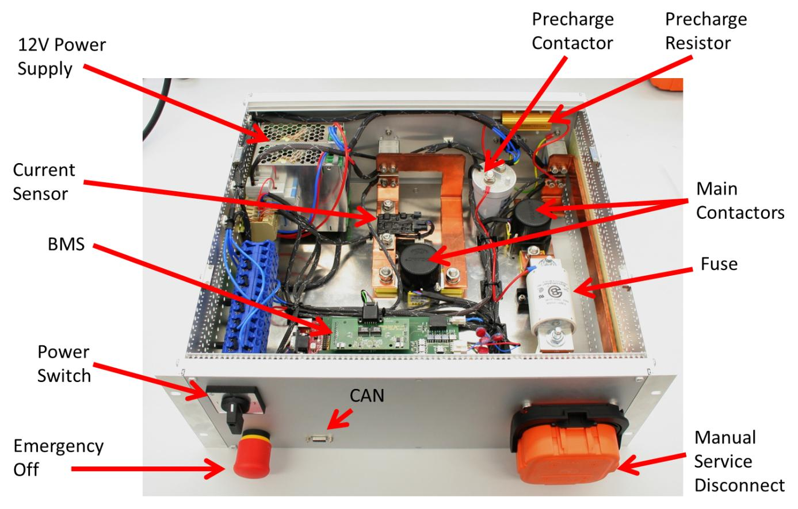
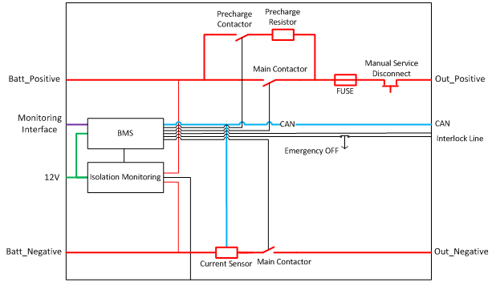

.. _bjb_description:

Example of Battery Junction Box
===============================

This section presents an example of a realization for a battery junction box. The design must be
adapted to the application.

Introduction
------------

.. _system_spec:

System Specification
~~~~~~~~~~~~~~~~~~~~

The Battery Junction Box (BJB) described in this document is designed for mobile and stationary battery systems. The target system has a voltage range between 315V and 567V, while being capable to source and sink a continuous current of up to 320A.
The stationary battery consists of up to 14 series connected battery modules. Each module is a 15s2p configuration of 2.3V 20Ah lithium titanate prismatic battery cells.

System Overview
~~~~~~~~~~~~~~~

The BJB contains the Battery Management System (BMS) and all safety components. :numref:`Fig. %s <big_bjb>` shows a BJB integrated into a 19" enclosure with a 4U height.

.. _big_bjb:

   BJB top view
   
:numref:`Fig. %s <block_diagram>` shows the block diagram of the BJB. The battery is connected to the BJB at the left side (Batt_Positive and Batt_Negative). The source/sink (e.g., inverter) is connected to the right side (Out_Positive and Out_Negative).

The main contactors disconnect the battery from the output terminals. These are normally off and switched on in BMS ON-Mode. The contactors are opened in hazardous conditions detected by the BMS (e.g., abnormal battery cell temperature) or in BMS OFF-Mode.

A precharge contactor and resistor are used to limit inrush current into the inverter DC-link capacitor when closing the main contactors at startup.

To limit the current flowing in short circuit condition, a fuse is placed in the positive current path. A special DC fuse must be used for battery systems. A Cooper-Bussmann FWP-350A fuse was selected for this system. The fuse is rated to 700V DC/AC.

.. _block_diagram:

   BJB block diagram

A Manual Service Disconnect (MSD) is placed in the positive current path to ensure a manual disconnection while the system is serviced. It is mounted on the front of the BJB for easy access. The MSD used is available as fused version (with integrated fuse) or as shunted version without fuse. In case of using the fused version, the Cooper-Bussmann fuse can be omitted, but the integrated fuse version is limited to 200A.

The Battery Management System (BMS) is the main control unit of the whole battery system. It collects data from the battery modules (e.g., battery cell voltages, cell temperatures, balancing transistors states) and from the current sensor, and uses these data for battery state calculations (e.g., SOC). In addition, the BMS controls the contactors and communicates with a superior management unit through the CAN bus.

Battery Junction Box Part List
------------------------------

In-stock Products
~~~~~~~~~~~~~~~~~

:numref:`Table %s <instock_products>` shows the components used in the BJB. All components were selected to fit the system specification listed in :ref:`system_spec`. If another battery configuration than specified there is used, the voltage and current ratings of these components have to be checked and adapted.

.. _instock_products:

.. table:: BJB part list

  +-------------------------+---------------+-------------------------------+--------------------+
  |Part Description         |Manufacturer   |Part Suggested                 |Supplier            |
  +-------------------------+---------------+-------------------------------+--------------------+
  |Power Switches           |Gigavac        |GX16-BEB (600A)                |HVC Technologies    |
  +-------------------------+---------------+-------------------------------+--------------------+
  |Precharge Switch         |  TE           |LEV200A4ANA                    |Mouser              |
  +-------------------------+---------------+-------------------------------+--------------------+
  |Precharge Resistor       |               |100W 680Ohm                    |Farnell             |
  +-------------------------+---------------+-------------------------------+--------------------+
  |DC Fuse*                 |Cooper Bussmann|FWP-Series                     |Mouser              |
  +-------------------------+---------------+-------------------------------+--------------------+
  |Current Sensor           |Isabellenhuette|IVT Mod 300                    |Isabellenhuette     |
  +-------------------------+---------------+-------------------------------+--------------------+
  |Emergency Off Button     |Moeller        |M22-PV/K11 + M22 K01           |Farnell             |
  +-------------------------+---------------+-------------------------------+--------------------+
  |Insulation Monitoring    |Bender         |ISO F1 IR155 3204              |Bender              |
  +-------------------------+---------------+-------------------------------+--------------------+
  |BMS                      |Fraunhofer IISB|                               |Fraunhofer IISB     |
  +-------------------------+---------------+-------------------------------+--------------------+
  |Manual Service Disconnect|TE             |AMP + Manual Service Disconnect|Power & Signal Group|
  +-------------------------+---------------+-------------------------------+--------------------+
  |12V Power Supply         |Meanwell       |WDR-120-12                     |Mouser              |
  +-------------------------+---------------+-------------------------------+--------------------+
  |Power Switch             |Kraus & Naimer |G20S D322-600 E                |Kraus & Naimer      |
  +-------------------------+---------------+-------------------------------+--------------------+

\* rated current and voltage are dependent of the used battery cells

Custom Parts
~~~~~~~~~~~~

In addition to the components listed in :numref:`table %s <instock_products>`, sundries not listed here are needed (e.g., terminal blocks). :numref:`Table %s <custom_products>` shows the wires used inside the BJB. Basically only 0.5mm\ :sup:`2` wires are used. Wires are used for signals and low voltage (12V supply) only. The insulation rating must exceed the maximum voltage of the whole battery pack.

.. _custom_products:

.. table:: Litz wires used inside the BJB

  +------------+---------------+-----------------------------------+
  |Color       |Cross Section  |Usage                              |
  +------------+---------------+-----------------------------------+
  |Red         |0.5mm\ :sup:`2`|12V Supply Positive                |
  +------------+---------------+-----------------------------------+
  |Blue        |0.5mm\ :sup:`2`|12V Supply Ground                  |
  +------------+---------------+-----------------------------------+
  |Orange      |0.5mm\ :sup:`2`|Insulation Monitoring              |
  +------------+---------------+-----------------------------------+
  |Blue/Yellow |0.5mm\ :sup:`2`|Insulation Monitoring              |
  +------------+---------------+-----------------------------------+
  |Brown/Grey  |0.5mm\ :sup:`2`|CAN High                           |
  +------------+---------------+-----------------------------------+
  |Brown/Orange|0.5mm\ :sup:`2`|CAN Low                            |
  +------------+---------------+-----------------------------------+
  |Green/Orange|0.5mm\ :sup:`2`|Interlock Line                     |
  +------------+---------------+-----------------------------------+
  |Green       |0.5mm\ :sup:`2`|Battery Monitoring Backup Interface|
  +------------+---------------+-----------------------------------+
  |Grey/White  |0.5mm\ :sup:`2`|Battery Monitoring Backup Interface|
  +------------+---------------+-----------------------------------+
  |Brown/Purple|0.5mm\ :sup:`2`|Battery Monitoring Main Interface  |
  +------------+---------------+-----------------------------------+
  |Red/Green   |0.5mm\ :sup:`2`|Battery Monitoring Main Interface  |
  +------------+---------------+-----------------------------------+

For the high power DC-connections, copper bus bars are used, since high current pulses can occur. The copper bus bars were fabricated with a cross section of 150mm\ :sup:`2` (5mm x 30mm) for the maximum continuous current specified in :ref:`system_spec`.

Main and Precharge Contactors Wiring
------------------------------------

The main and precharge contactors are delivered with bare wire ends. The corresponding crimp and plug must be used to connect to the BMS.

Insulation Monitor Wiring
-------------------------

The Bender insulation monitor is delivered with a socket on its PCB. The corresponding crimp and plug is included in the packing and should be used.

Current Sensor Wiring
---------------------

The current sensor is supplied with its crimps and housings (by JST). The sensor has to be wired to the CAN bus and a power supply. In addition, voltage sense wires may be connected to the sensor. The current sensor may measure up to three voltages. They are installed as follows:
 
 * Voltage measurement 1: between fuse and main contactor
 * Voltage measurement 2: between fuse and service disconnect (MSD)
 * Voltage measurement 3: between battery positive and precharge contactor

When closing the precharge contactor after closing main negative contactor, these measured voltages are used to ensure a correct precharge procedure.

Summary of the assembly procedure
---------------------------------

For developing and building the BJB, the following procedure may be used:

 1. Defining the specification of the battery (e.g., maximum current, maximum voltage)
 2. Defining the placement of the input (from the battery) and the output (to the user) connectors and the manual service disconnect
 3. Placement of the main parts of the current path (e.g., main contactors)
 4. Designing of the copper bus bars (alternatively wire with appropriate cross section may be used)
 5. Placement of the BJB electronic parts (e.g., BMS)
 6. Wiring of the electronic parts

