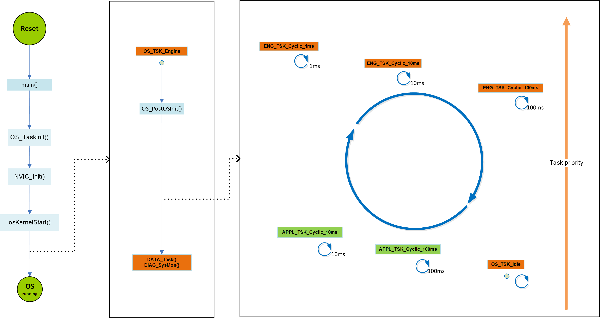
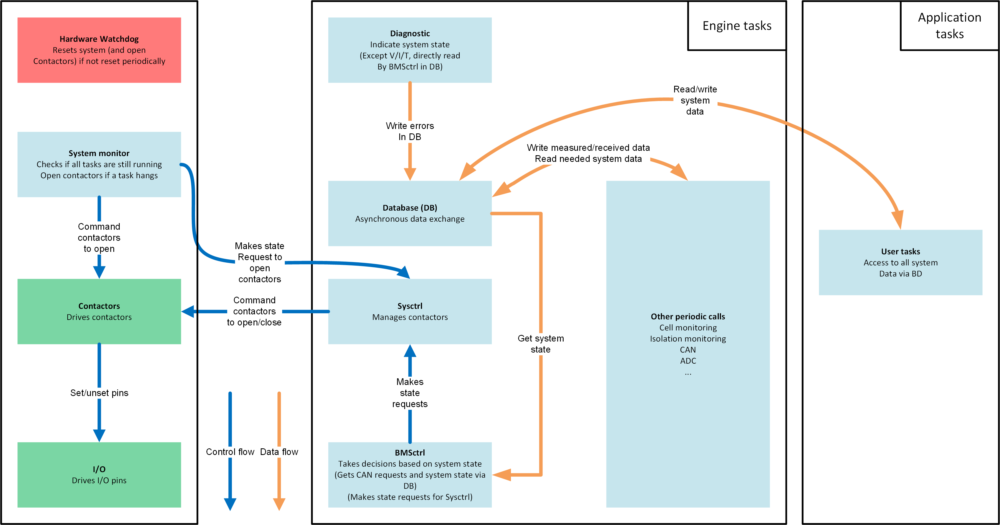

.. include:: ../../macros.rst

==================================
Basic Function of the BMS Software
==================================

.. highlight:: C

Startup
-------
The startup code begins at the label Reset_Handler in ``general/config/startup_stm32f429xx.s``. After initialization of the basic microcontroller registers, the system clock unit and the memory data (e.g., stack- and program pointer, system control block (SCB), interrupt vector, pre-initialization of data-sections, FPU settings), the C function ``main()`` is called. In ``general/main.c`` the second step of initializations of the microcontroller unit, peripherals and software modules are done (e.g., interrupt priorities, hardware modules like SPI and DMA). At this point, interrupts are still disabled. The steps are indicated by the global variable ``os_boot``. At the end of the main function, the operating system resources (tasks, events, queues, mutex) are configured in ``OS_TaskInit()`` (``os/os.c``) and the scheduler is started by enabling the interrupts. Scheduling is started by invoking all configured tasks (FreeRTOS threads) regarding their priority. The activation of the scheduling is indicated by ``os_boot = OS_RUNNING``. The OS-scheduler first calls the task ``void OS_TSK_Engine(void)`` as the highest priority is assigned to this task. All other tasks are blocked in a while-loop until ``OS_TSK_Engine()`` finishes the third initialization step and enters the periodic execution.

Engine
------

The task ``void OS_TSK_Engine(void)`` executes the third (and last) step of system initialization with enabled interrupts in ``OS_PostOSInit()``. Then after ``OS_TSK_Engine()`` manages the database and system monitoring via periodically call of ``DATA_Task()`` and ``DIAG_SysMon()`` periodically in 1ms.

After that, ``os_boot`` is set to ``OS_SYTEM_RUNNING`` and the system runs the following tasks periodically:

 - ``void OS_TSK_Cyclic_1ms(void)``
 - ``void OS_TSK_Cyclic_10ms(void)``
 - ``void OS_TSK_Cyclic_100ms(void)``

It must be noted that no changes should be made directly in these functions, since they are used as wrapper: they call the following functions:

 - ``void ENG_TSK_Cyclic_1ms(void)``
 - ``void ENG_TSK_Cyclic_10ms(void)``
 - ``void ENG_TSK_Cyclic_100ms(void)``

where the effective calls for system tasks are made. These three functions and ``OS_TSK_Engine()`` make up the core of the system and are called ``engine``. These function calls are found in ``engine/task/enginetask.c``. Additionally, two users tasks run periodically. They are described in :ref:`usr_apps`. The start-up sequence is shown in :numref:`fig. %s <startup_simplified>`.

.. _startup_simplified:

   
   |foxbms| system start-up

The database runs with the highest priority in the system and provides asynchronous data exchange for the whole system. :numref:`Fig. %s <database>` shows the data exchanges implemented via the database.

.. _database:
.. figure:: database.png
   :width: 100 %
   
   Asynchronous data exchange with the |foxbms| database

:numref:`Fig. %s <engine>` shows the basic structure of |foxbms|, which is based on the engine tasks.

.. _engine:

   
   Basic tasks in |foxbms|

The two key functions called within the engine tasks are:

 - ``SysControl``
 - ``BMSControl``

``SysControl`` has a lower priority than the database and a higher priority than ``BMSControl``. Both modules are implemented as a state machine, with a trigger function that implements the transition between the states and a control function that makes state requests to navigate between the states. The trigger and control functions are called in ``void ENG_TSK_Cyclic_1ms(void)`` and ``void ENG_TSK_Cyclic_10ms(void)``.
``SysControl`` controls the operating state of the BMS and the contactors. As it is implemented as a state machine, ``SysControl`` state requests have to be done by ``SYSCTRL_SetStateRequest()``. ``SysControl`` controls the contactors accordingly.

``BMSControl`` gathers info on the system via the database and takes decisions based on this data. The BMS is driven via CAN. Requests are made via CAN to go either in STANDBY mode (i.e., contactors are open) or in NORMAL mode (i.e., contactors are closed). A safety feature is that these requests must be sent periodically every 100ms. ``BMSControl`` retrieves the state requests received via CAN from the database and analyses them. If the requests are not sent correctly, this means that the controlling unit driving the BMS has a problem and the correctness of the orders sent to the BMS may not be given anymore. As a consequence, in this case ``BMSControl`` makes a request to ``SysControl`` to open the contactors. Currently, ``BMSControl`` checks the cell voltages, the cell temperatures and the global battery current. If one of these physical quantities show a value out of the safe operating area, ``BMSControl`` makes the corresponding state request to ``SysControl`` to open the contactors. ``BMSControl`` is started via an initial state request, after which it functions without other requests.

A watchdog instance is needed in case one of the aforementioned tasks hangs: in this case, the control over the contactors would not be provided anymore. This watchdog is made by the System Monitor module which monitors all important tasks (e.g., ``Database``, ``SysControl``, ``BMSControl)``: if any of the monitored tasks hangs, the contactors are opened to prevent damage and protect persons and the battery. To ensure the highest level of safety, opening the contactors is made by two ways:

 - State request to ``SysControl`` to open the contactors
 - Direct access to the |mod_contactor| in case ``SysControl`` is not responding anymore

A last barrier is present in case all the preceding measures fail: the hardware watchdog timer. In case it is not triggered periodically, it resets the systems, provoking the opening of the contactors. Function calls (other than ``SysControl`` and ``BMSControl)`` and closely related to the system are made in the engine tasks, for example:

 - CAN
 - Battery cells monitoring (voltages and temperatures)
 - Galvanic isolation monitoring
 - Lithium 3V button cell voltage monitoring
 - System LED blink

Diagnostic
----------

The |mod_diag| is designed to report problems on the whole system. The events that trigger the |mod_diag| have to be defined by the user. The event handler ``DIAG_Handler(...)`` has to be called when the event is detected. The way the system reacts to a ``Diag`` event is defined via a callback function or by the caller according the return value.

Diagnostic events are stored in the Backup SRAM memory in variable ``DIAG_ERROR_ENTRY_s diag_memory[]``

.. code-block:: C

   typedef struct {
       uint8_t JJ;              // date and time of event (JJMMDDhhmmss)
       uint8_t MM;
       uint8_t DD;
       uint8_t hh;
       uint8_t mm;
       uint8_t ss;
       DIAG_EVENT_e event;      // event OK (no error), event NOK (error)
       DIAG_CH_ID_e event_id;   // diagnosis event ID
       uint8_t item;            // unique item of event (optional sub-ID)
       uint8_t dummy1;
       uint8_t dummy2;
       uint8_t dummy3;
       uint32_t dummy4;
       uint32_t Val0;           // specific value of event (optional)
       uint32_t Val1;           // specific value of event (optional)
       uint32_t Val2;           // specific value of event (optional)
       uint32_t Val3;           // specific value of event (optional)
    } DIAG_ERROR_ENTRY_s;

.. _usr_apps:

User Applications
-----------------

For the user applications, two periodic tasks are available:

 - ``void APPL_Cyclic_10ms(void)``
 - ``void APPL_Cyclic_100ms(void)``

Here, the user can implement its own functions, like new battery state estimation algorithms. The user has access to system data via the database. These function calls are found in ``application/task/appltask_cfg.c``.
