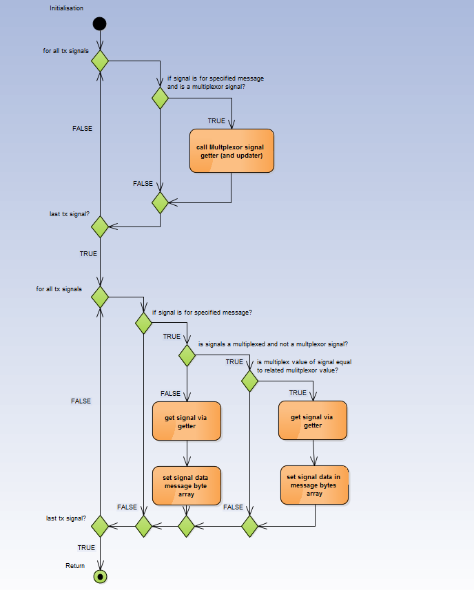

.. include:: ../../../macros.rst

==========
CAN Signal
==========

.. highlight:: C

The |mod_cansignal| is a software module to handle the conversion from data providers like a database or measurement modules to the |mod_can|. It works similar to a typical IPO (input-processing-output) pattern.

Module Files
~~~~~~~~~~~~

Driver:
 - ``src\module\cansignal\cansignal.h``
 - ``src\module\cansignal\cansignal.c``
 
Driver Configuration:
 - ``src\module\config\cansignal_cfg.h``
 - ``src\module\config\cansignal_cfg.c``
 
Dependencies
~~~~~~~~~~~~
CAN:
 - ``src\module\can\can.h``
 
Other dependencies can arise from callback functions in configuration of |mod_cansignal|.

Detailed Description of the |mod_cansignal|
~~~~~~~~~~~~~~~~~~~~~~~~~~~~~~~~~~~~~~~~~~~~~~

File Structure and Interfaces
-----------------------------
The |mod_cansignal| is a simple one-file module with one-file configuration:

 - The module itself consists of one file ``cansignal.c`` and its associated ``cansignal.h``
 - The configuration is given in ``cansignal_cfg.c`` and its associated ``cansignal_cfg.h``

The external interface to the |mod_cansignal| is very easy and consists of just two functions:

 - CANS_Init
 - CANS_MainFunction

CANS_Init is for parameter and configuration checking of the |mod_cansignal|. 

CANS_MainFunction is for data processing and should be called periodically.

Data Flow
---------
The data flow is generally divided in two different domains, one for reception of CAN messages and signal value distribution, the other for transmission of CAN message and signal value assembling/message composition.

When a CAN message is received physically, it is stored in a buffer in |mod_can| (not in |mod_cansignal|). From this buffer all CAN messages are fetched periodically by call of ``CANS_MainFunction``. If the fetch was successful (i.e., a CAN message has been received and stored in the buffer), the message is processed, the signals included in this message are extracted, scaled and handed over to a data consumer via the callback setter function.

When a CAN message needs to be transmitted physically, the signals data belonging to this CAN message are collected via their getter callback function. From this signals data, the CAN message is assembled. If everything worked fine, it is stored in the buffer in CAN module, and will be sent out over the CAN peripheral hardware.

:numref:`fig. %s <cansignal_figure1>` shows the data flow used to assemble a CAN message.

.. _cansignal_figure1:
.. figure:: CANSMsgHandling_xxl.png
   :width: 100 %

   CAN data flow to assemble messages

Control Flow
------------

The module operates from a single function call to ``CANS_MainFunction``.

First the periodic message transmission is handled in this function. If correspondence of an internal tick counter to a message repetition time and phase is detected (i.e., the periodic time expired) the CAN message is composed from its signals. Therefore all signals, which are included in a message, are collected via their getter callback and written to the message data block at the right position in the right length. This message data block together with the ID, Data Length Code and so on, is handed over to the |mod_can|, which handles the low level transmission to the CAN specific peripheral registers.

The message reception in turn is done by reading out the buffer of the |mod_can|. Then the signals configuration is searched for this message(s). If one signal is represented in these received messages it is extracted and handed over to the setter callback function configured for this signal.

.. _CANSIGNAL_CAN_CONFIG:

CAN Configurations
~~~~~~~~~~~~~~~~~~

Default Configuration
---------------------

The configuration comprises:

* arrays for message definition, for both receive and transmit signals
* arrays for signal definition, for both receive and transmit signals
* callback function implementations for getting and setting of signals
* callback function implementations for post-processing after transmission and reception of messages

.. _CANMultiplex:

Custom Configuration Examples
-----------------------------

**Multiplexed TX message example**

A message can contain signals (called multiplexed signals), that have different meaning depending on another signal (called multiplexor signal).

Typical examples for multiplexed signals in |foxbms| software are the signals for the transmission of the battery cell voltages. When there are a lot of modules and transmit every voltage measurement in its specific single signal, this could result in many messages with different CAN IDs. Also the CAN bus load can increase to an unacceptable level by sending all of these messages periodically with a high cycle time.

For example, in the |foxbms| software, four CAN messages are used for the twelve battery cell voltages of a single module, in which three voltage measurement values are combined in one CAN message together with a multiplexor (e.g., 3 * 16bit voltage measurement + multiplexor + status + counter < 64 bit maximum CAN message length). This results in the need for four CAN IDs. The multiplexor value then specifies the module number to which the actual voltage measurement signals belong.

In the ``cansignal_cfg.c`` this is represented in the signal definition array ``cans_signals_tx`` and ``cans_signals_rx`` of type ``CANS_signal_s`` by the following struct members:
  
  - boolean isMuxed;
  - boolean isMuxor;
  - uint8_t muxValue;
  - CANS_signals_t muxor;

In detail these members can be described as:

  - isMuxed: flag, indicates if multiplexed (TRUE for multiplexed signals)
  - isMuxor: flag, indicates if multiplexor (TRUE for the multiplexor signal)
  - muxValue: number of multiplex value, e.g., 0 for the first module, when indicating module number 
  - muxor: symbolic name of multiplexor signal, for example ``{CANS_BMSx_Mux}``
  
The control flow for transmission of a multiplexed signal in the CANSIGNAL module is shown in :numref:`fig. %s <cansignal_figure2>`.

.. _cansignal_figure2:

   CAN data flow to assemble message
   
Disadvantage of the multiplexing is the asynchronous transmission of the voltage measurement values of different modules (but asynchronous transmission does not necessarily mean asynchronous A/D sampling).

.. note::
	The getter of the multiplexor signal is responsible for incrementing and resetting the multiplexor value.

**Specific example with transmission of the battery temperatures**

TX signal array:

.. code-block:: C

   const CANS_signal_s cans_signals_example[9] = {
   //  ID                             isMuxed  isMuxor muxVal        setter    getter
      { {MSD_ID_TEMP},  0, 2, 3, 0, 1, 0,FALSE,    TRUE,     0,   0, &setmux,  &getmux}, //!<  multiplexor
      { {MSD_ID_TEMP},  8,16, 0, 0, 1, 0, TRUE,   FALSE,     0,   0,&setTemp, &getTemp}, //!<  temp1 of module0
      { {MSD_ID_TEMP}, 32,16, 0, 0, 1, 0, TRUE,   FALSE,     0,   0,&setTemp, &getTemp}, //!<  temp2 of module0
      { {MSD_ID_TEMP},  8,16, 0, 0, 1, 0, TRUE,   FALSE,     1,   0,&setTemp, &getTemp}, //!<  temp1 of module1
      { {MSD_ID_TEMP}, 32,16, 0, 0, 1, 0, TRUE,   FALSE,     1,   0,&setTemp, &getTemp}, //!<  temp2 of module1
      { {MSD_ID_TEMP},  8,16, 0, 0, 1, 0, TRUE,   FALSE,     2,   0,&setTemp, &getTemp}, //!<  temp1 of module2
      { {MSD_ID_TEMP}, 32,16, 0, 0, 1, 0, TRUE,   FALSE,     2,   0,&setTemp, &getTemp}, //!<  temp2 of module2
      { {MSD_ID_TEMP},  8,16, 0, 0, 1, 0, TRUE,   FALSE,     3,   0,&setTemp, &getTemp}, //!<  temp1 of module3
      { {MSD_ID_TEMP}, 32,16, 0, 0, 1, 0, TRUE,   FALSE,     3,   0,&setTemp, &getTemp}, //!<  temp2 of module3
   }

Usage/Examples
~~~~~~~~~~~~~~

To use |mod_can| and |mod_cansignal| with a correct :ref:`CANSIGNAL_CAN_CONFIG`, just call ``CANS_MainFunction`` in the cyclic tasks timeslot, that is configured in ``CANS_TICK_MS``.

