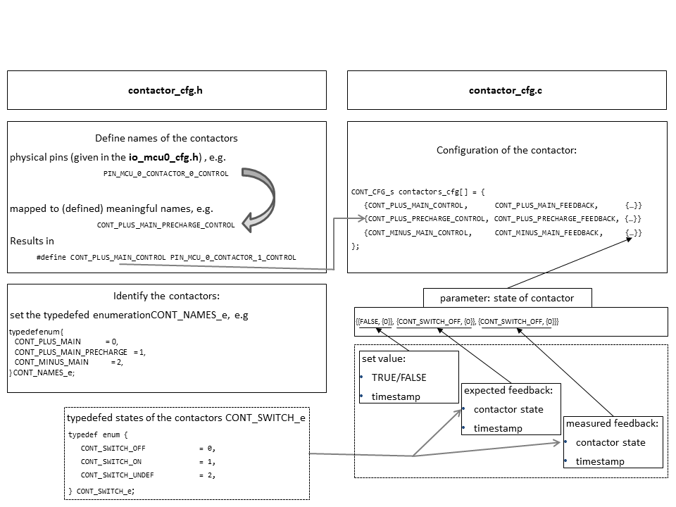

Contactor
=========

.. include:: ../../../macros.rst

.. highlight:: C

This user manual describes the configuration of the contactor using the |contactor module|. The 
behaviour of the contactors is only depended on the configuration and driver should not be needed to be changed.

.. ignore .. sectnum::

.. contents:: Table Of Contents

Module Files
~~~~~~~~~~~~

Driver:
 - src\\module\\cont\\contactor.h
 - src\\module\\cont\\contactor.c
 
Driver Configuration:
 - src\\module\\config\\contactor_cfg.h
 - src\\module\\config\\contactor_cfg.c
 
Dependencies
~~~~~~~~~~~~
 - io-module

Configuration of the Contactors
~~~~~~~~~~~~~~~~~~~~~~~~~~~~~~~
In the configuration header the set-up of the following variables is 
configurable at user level through Foxygen:
-  ``CONT_HAS_NO_FEEDBACK_SWICHTING_TIME, (100ms)``
- ``CONT_MAXIUMUM_ALLOWED_CONTACTOR_SWITCHING_TIkME (100ms)``
- ``CONT_NUMBER_OF_BAD_COUNTINGS``
- ``BAD_SWITCHOFF_CURRENT_POS``
- ``BAD_SWITCHOFF_CURRENT_NEG``

A contactor physically consists of an control pin, an optional 
feedback pin, which can be configured as normally open or normally 
closed.
This hardware condition is mapped in the software in the contactor 
set-up files in ``contactor_cfg.c`` and ``contactor_cfg.h``.

The entry point to change the contactor configuration is the 
configuration header file ``contactor_cfg.h``.
At first the general naming of the contactors the ``io``-configuration 
(``PIN_MCU_0_CONTACTOR_0_CONTROL``, etc.) is mapped in the contactors to 
something  meaningful one has to define names for the contactors, 
e.g. the ``contactor0`` should be the precharge contactor and has a
feedback pin:

.. code-block:: C

   #define CONT_PLUS_MAIN_PRECHARGE_CONTROL        PIN_MCU_0_CONTACTOR_0_CONTROL
   #define CONT_PLUS_MAIN_PRECHARGE_FEEDBACK       PIN_MCU_0_CONTACTOR_0_FEEDBACK

Note: if the contactor had no feedback one would define

.. code-block:: C

   #define CONT_PLUS_MAIN_PRECHARGE_CONTROL        PIN_MCU_0_CONTACTOR_0_CONTROL
   #define CONT_PLUS_MAIN_PRECHARGE_FEEDBACK       CONT_HAS_NO_FEEDBACK

At next the contactors are identified by setting up the typedefed 
enumeration ``CONT_NAMES_e``. E.g. if there are three contactors,
two in the positive path (one for precharge and a main contactor) 
and a main contactor in the negative path, the configuration of the 
``CONT_NAMES_e`` looks like this (the names are free of choice)

.. code-block:: C

   typedef enum {
       CONT_PLUS_MAIN              = 0,
       CONT_PLUS_MAIN_PRECHARGE    = 1,
       CONT_MINUS_MAIN             = 2,
   } CONT_NAMES_e;

At this point the configuration of the header is done and the
configuration is finished in ``contactor_cfg.c``

The pins, where the contactors are connected to MCU, and the hardware
configuration are now composed to a contractor object/struct.
We stay at the given example above and configure the contactors 
accordingly, where we assume that the contactors have a feedback
and are normally open. The setup summed up would look like this:

=============================    ====================================   =====================================   ===============================
Contactor                        Control pin                            Feedback pin                            Hardware feedback configuration 
=============================    ====================================   =====================================   ===============================
 ``CONT_PLUS_MAIN``              ``CONT_PLUS_MAIN_CONTROL``             ``CONT_PLUS_MAIN_FEEDBACK``             ``CONT_FEEDBACK_NORMALLY_OPEN``
 ``CONT_PLUS_MAIN_PRECHARGE``    ``CONT_PLUS_MAIN_PRECHARGE_CONTROL``   ``CONT_PLUS_MAIN_PRECHARGE_FEEDBACK``   ``CONT_FEEDBACK_NORMALLY_OPEN``
 ``CONT_MINUS_MAIN``             ``CONT_MINUS_MAIN_CONTROL``            ``CONT_MINUS_MAIN_FEEDBACK``            ``CONT_FEEDBACK_NORMALLY_OPEN``
=============================    ====================================   =====================================   ===============================

This would result in the following configuration in the source code for the hardware configuration

.. code-block:: C

   CONT_CFG_s cont_contactors_cfg[NR_OF_CONTACTORS] = {
        {CONT_PLUS_MAIN_CONTROL,        CONT_PLUS_MAIN_FEEDBACK,        CONT_FEEDBACK_NORMALLY_OPEN},
        {CONT_PLUS_PRECHARGE_CONTROL,   CONT_PLUS_PRECHARGE_FEEDBACK,   CONT_FEEDBACK_NORMALLY_OPEN},
        {CONT_MINUS_MAIN_CONTROL,       CONT_MINUS_MAIN_FEEDBACK,       CONT_FEEDBACK_NORMALLY_OPEN}
   };

and a corresponding feedback state configuration

.. code-block:: C

   CONT_STATES_s cont_contactor_states[NR_OF_CONTACTORS] = {
        {{FALSE, 0},    {CONT_SWITCH_OFF, 0},   {CONT_SWITCH_OFF, 0}},
        {{FALSE, 0},    {CONT_SWITCH_OFF, 0},   {CONT_SWITCH_OFF, 0}},
        {{FALSE, 0},    {CONT_SWITCH_OFF, 0},   {CONT_SWITCH_OFF, 0}}
   };

IMPORTANT: The configuration in ``CONT_CFG_s contactors_cfg[]`` 
must have the same order as defined in ``CONT_NAMES_e``.

The parameters after the feedback type parameter display the state 
the contactor is in. The initial state of the contactor is always 
switched off. The state variables store the set value (``TRUE`` 
or ``FALSE``) , the expected feedback (``CONT_SWITCH_OFF`` or
``CONT_SWITCH_ON``) and the measured feedback 
(``CONT_SWITCH_OFF`` or ``CONT_SWITCH_ON``) and the according
timestamp to each (``os_timer``).

At this point the contactors' setup is finished.

:numref:`Fig. %s <contactor_figure1>` gives a visualization of the configuration.

.. _contactor_figure1:

   Contactor configuration 

Interaction
~~~~~~~~~~~

The |syscontrol module| uses the |contactor module|'s APIs.

