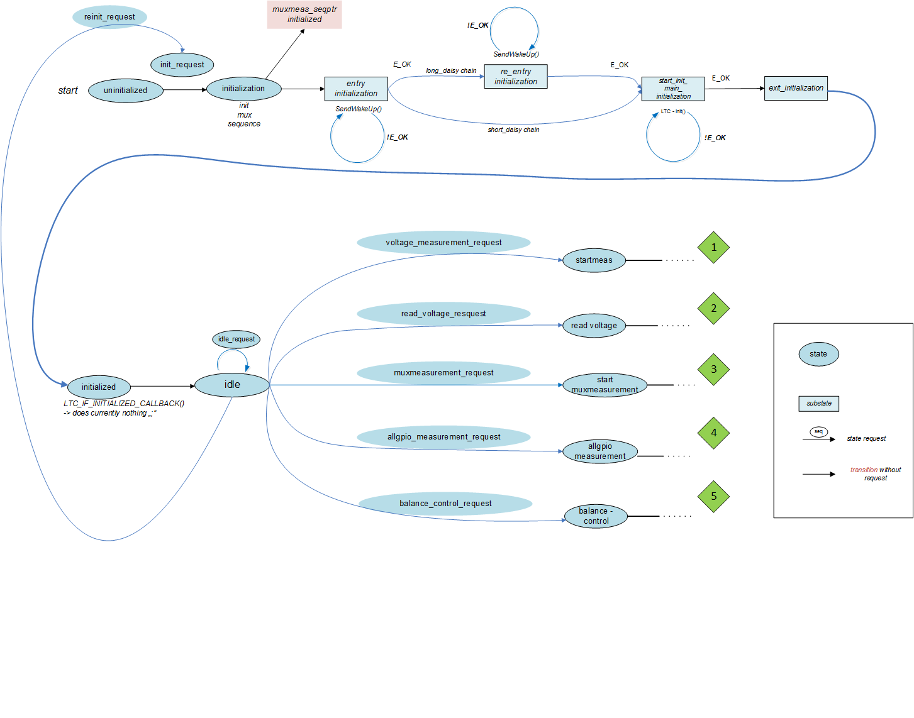
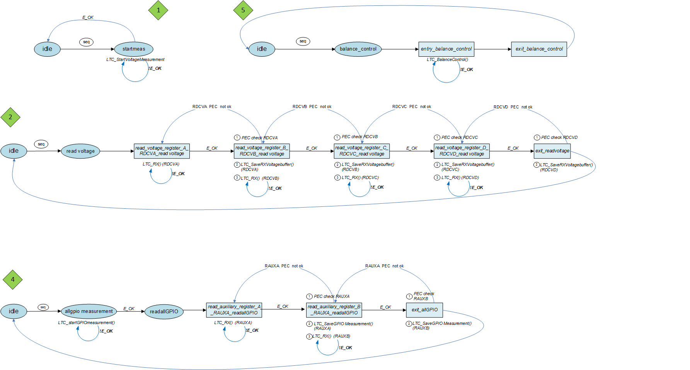
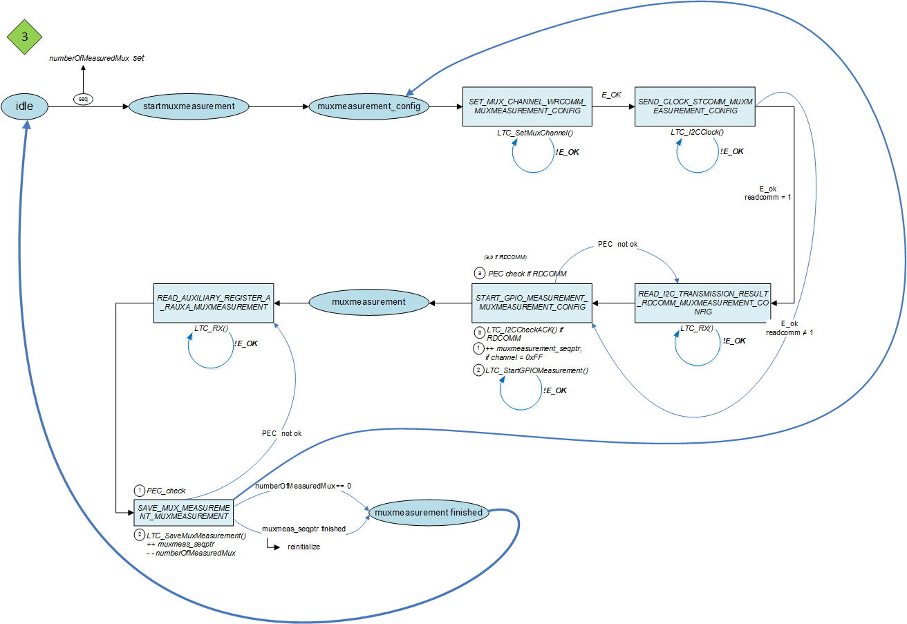

.. include:: ../../../macros.rst

===
LTC
===

.. highlight:: C

The driver communicates with the |LTC| monitoring chips in daisy-chain configuration. The chips are used to:

 - measure the battery cell voltages
 - measure the voltages directly on the GPIOs
 - measure the voltage of up to 32 inputs via I2C-driven multiplexer
 - enable passive balancing of the connected battery cells

Module Files
~~~~~~~~~~~~

Driver:
 - ``src\module\ltc\ltc.c``
 - ``src\module\ltc\ltc.h``
 
Driver Configuration:
 - ``src\module\config\ltc_cfg.c``
 - ``src\module\config\ltc_cfg.h``

Dependencies
~~~~~~~~~~~~

 - ``src\module\cpu\cpu.h``
 - ``src\module\diag\diag.h``
 - ``src\module\spi\spi.h``

Detailed Description of the |mod_ltc|
~~~~~~~~~~~~~~~~~~~~~~~~~~~~~~~~~~~~~~~~

State Machine
-------------

The |mod_ltc| is organized in a state machine, which is mainly implemented with 4 functions:

 - ``LTC_Trigger()``: called every 1ms, contains the sequence of events in the state machine
 - ``LTC_Ctrl()``: makes state requests to the state machine, so that the |LTC| performs its tasks
 - ``LTC_SetStateRequest()``: used in ``LTC_Ctrl()`` to make the state requests
 - ``LTC_CheckStateRequest()``: called by ``LTC_SetStateRequest()`` to check the state requests. Returns the result of the check immediately.

The operation of the state machine is described hereafter. First, the daisy chained |LTC| is initialized as shown in :numref:`fig. %s <ltc_figure1>`. 

.. _ltc_figure1:

   |LTC| internal state machine (initialization)

After initilization, the state machine goes in the ``idle`` state, where the user can make five different requests:

 - measure voltages
 - read measured voltages
 - read multiplexer inputs
 - read GPIO inputs
 - balance cells

The function ``LTC_SetStateRequest()`` is used to make these state requests to the |LTC| state machine. :numref:`Fig. %s <ltc_figure2>` and :numref:`%s <ltc_figure3>` detail how these possible state requests are handled.
 
.. _ltc_figure2:

   
   |LTC| state machine (voltage measurement, voltage readout, all GPIOs measurement)

.. _ltc_figure3:

   |LTC| state machine (measurement of a single GPIO)

Results Retrieval and Balancing Orders
--------------------------------------

The results of the measurements are written in the database. The balancing is made according to the control variable set in the database.
The corresponding variables are:

.. code-block:: C

   DATA_BLOCK_CELLVOLTAGE_s           ltc_cellvoltage; //cell voltages
   DATA_BLOCK_CELLTEMPERATURE_s       ltc_celltemperature; //cell temperature
   DATA_BLOCK_MINMAX_s                ltc_minmax; //minimum and maximum values at battery pack
                                                  //level for voltages and temperatures
   DATA_BLOCK_BALANCING_FEEDBACK_s    ltc_balancing_feedback; //result from balancing feedback
                                                              //(is each cell balanced or not)
   DATA_BLOCK_BALANCING_CONTROL_s     ltc_balancing_control; //balancing orders read from database

Configuration of the |mod_ltc|
~~~~~~~~~~~~~~~~~~~~~~~~~~~~~~~~~

SPI Interface
-------------

In ``ltc_cfg.h``, the SPI devices used by the |LTC| is defined by the macro ``SPI_HANDLE_LTC``. The SPI handle must be chosen from the list ``SPI_HandleTypeDef spi_devices[]`` in ``spi_cfg.c``. The frequency of the used SPI must be adjusted with the configuration in ``spi_cfg.c``, so that the frequency is not higher than 1MHz. This is the maximum allowed frequency for the |LTC| chip. The function ``LTC_SetTransferTimes()`` sets the waiting times used for the |mod_ltc| automatically at startup. It uses ``LTC_GetSPIClock()`` to get the SPI clock frequency automatically.

Measurement Mode and Channel Selection
--------------------------------------

When a request is made with the function ``LTC_SetStateRequest()`` to measure cell voltages or multiplexer inputs, two arguments must be given. The first one is the measurement mode, which can be:
 
 - normal
 - filtered
 - fast
 
These modes are defined in the |LTC| datasheet [ltc_datasheet]_. For cell voltage measurements, the macro ``VOLTAGE_MEASUREMENT_MODE`` is defined in ``ltc_cfg.h``. For multiplexers measurement, the macro ``GPIO_MEASUREMENT_MODE`` is defined in ``ltc_cfg.h``.

The second argument is the number of channels: The following enums are defined in ``ltc.h``:
 
 - ``LTC_ADCMEAS_ALLCHANNEL`` to measure all cell voltages/to measure all 5 GPIO inputs
 - ``LTC_ADCMEAS_SINGLECHANNEL`` to measure 2 cell voltages/to measure 1 GPIO input

Multiplexer Sequence
--------------------

In case of a single GPIO measurement, the multiplexer sequence to be read is defined in ``ltc_cfg.c`` with the variable ``LTC_MUX_CH_CFG_t ltc_mux_seq_main_ch1[]``. It is a list of elements of the following form:

.. code-block:: C

   {
       .muxID    = 1,
       .muxCh    = 3,
   }
    
where the multiplexer to select (muxID, can be 0, 1, 2 or 3) and the channel to select (muxCh, from 0 to 7) are defined. Channel 0xFF means that the multiplxer is turned off. This is used to avoid two or more multiplexers to have their outputs in a low-impedance state on the same time.

Temperature Sensor Assignment
-----------------------------

For temperature sensors, the variable is used to give the correspondence between the channel measured and the index used:

.. code-block:: C

   uint8 ltc_muxsensortemperaturmain_cfg[8] =
   {    8-1 ,  //channel 0
       7-1 ,  //channel 1
       6-1 ,  //channel 2
       5-1 ,  //channel 3
       4-1 ,  //channel 4
       3-1 ,  //channel 5
       2-1 ,  //channel 6
       1-1   //channel 7
   }

In the above example, channel 0 of the multiplexer corresponds to temperature sensor 8. If muxseqptr is the multiplexer sequence of type ``LTC_MUX_CH_CFG_t`` as defined above, the sensor index is retrieved in the variable ``sensor_idx`` via:

.. code-block:: C

   sensor_idx = ltc_muxsensortemperaturmain_cfg[muxseqptr->muxCh];

Usage
~~~~~

The |mod_ltc| cycle (cell voltage measurement, GPIO measurement, balancing control) is implemented in the function ``LTC_Ctrl()``. The default configuration is a measurement with multiplexers. Once the |LTC| daisy chain has been initialized, the cycle is as follow:

 - measure cell voltages
 - measure ``NUMBER_OF_MUX_MEASUREMENTS_PER_CYCLE`` multiplexer inputs
 - measure cell voltage
 - repeat till all multiplexer inputs have been read
 - balance cells according to the data in database

References
~~~~~~~~~~

.. [ltc_datasheet] LTC6804 Datasheet http://cds.linear.com/docs/en/datasheet/680412fb.pdf
