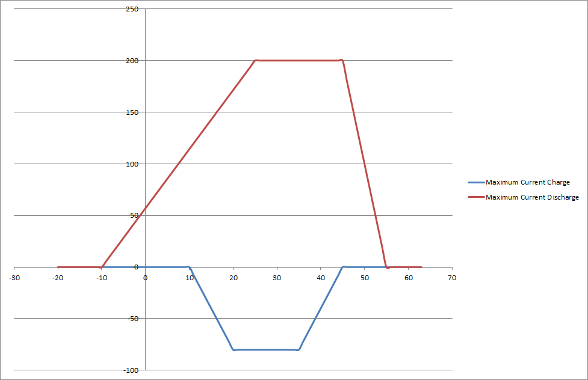
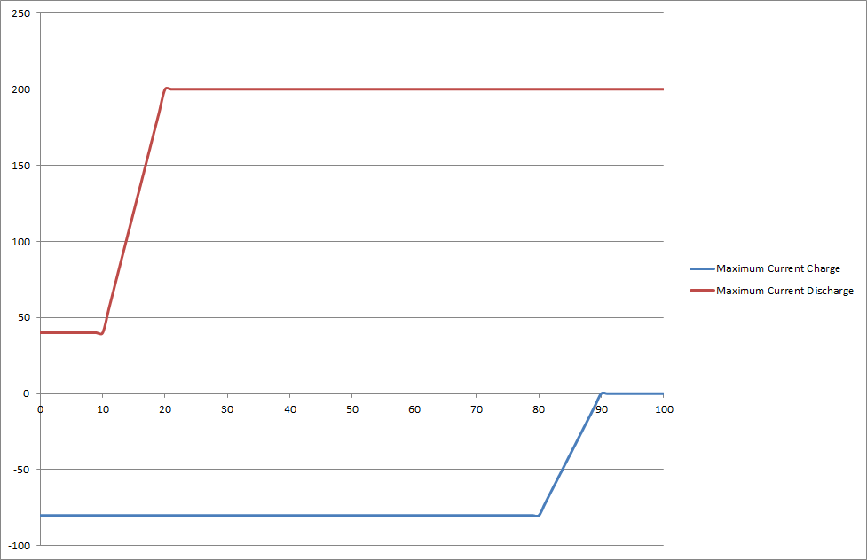
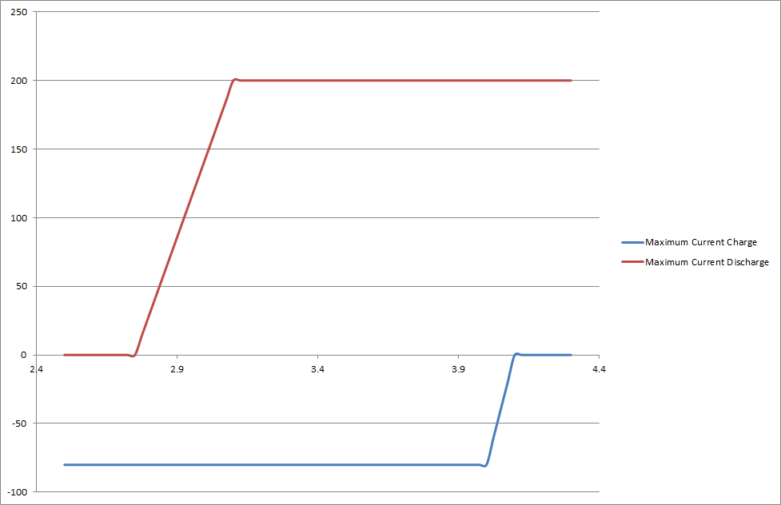

SOX
===

.. include:: ../../../macros.rst

.. highlight:: C

The calculation of a simple Coulomb counter is impelemented here and 
current derating depending on voltage, temperature and this SOC is performed. 

.. contents:: Table Of Contents

Module Files
~~~~~~~~~~~~

Driver:
 - src\\application\\sox\\sox.h
 - src\\application\\sox\\sox.c
 
Driver Configuration:
 - src\\application\\config\\sox_cfg.h
 - src\\application\\config\\sox_cfg.c

Dependencies
~~~~~~~~~~~~

Database:
 - src\\engine\\database\\database.h (included implicitly by general.h)
 
SOX module gets the relevant measurement minimum and maximum values from database 
and stores current derating values in database.

Detailed Description Of Module
~~~~~~~~~~~~~~~~~~~~~~~~~~~~~~

SOC
---

SOC is implemented in the form of a simple Coulomb counter. 

SOC initialization is done after startup by reading the value from the non volatile memory.

Not implemented right now is a intialization of the SOC by VOLTAGE-SOC relation (lookup table), 
but configuration placeholders are already in `SOX Configuration`_. These placeholders define the 
constraints at which the initialization with lookup table is valid.

SOF/Current derating
--------------------

**The state of function (SOF) consists of some current derating values.**

These derating is calculated according to battery cell specific constraints. 
Currently three parameters are taken in account:

 - temperature
 - SOC
 - voltage

Specific points in the following derating curves have to be defined by FOXYGEN configurable variables.  

   
   Temperature dependent current derating 

   
   SOC dependent current derating

   
   Voltage dependent current derating

These specific points are the values where derating starts and where it is at full extent. 
They are described in `Configuration Variables`_ and battery specific values can be seen 
for example in `Configuration example lithium titanate`_ and `Configuration example lithium NCA/NMC/...`_.

.. _SOX_CONFIG:

SOX Configuration
~~~~~~~~~~~~~~~~~

Configuration Variables
-----------------------

For the coulomb counting method the cell capacity (in case of parallel cell configuration the sum of 
parallel cells) has to be given here:

========================  =========   =====  ========   =============================================  ===============
NAME                      LEVEL       TYPE     UNIT     DESCRIPTION                                    DEFAULT
========================  =========   =====  ========   =============================================  ===============
SOX_CELL_CAPACITY         devel       float    mAh      cell capacity in SOC formula coulomb counter   20000.0
========================  =========   =====  ========   =============================================  ===============

Currently there is only placeholder for the initialization by a Voltage-SOC relation. The following configuration can be
used after implementation: 

===========================   =====  ========   ============================================  ===============
NAME                          TYPE     UNIT     DESCRIPTION                                   DEFAULT
===========================   =====  ========   ============================================  ===============
SOX_SOC_INIT_CURRENT_LIMIT    int      mA       at initialization the current must be below    100
SOX_DELTA_MIN_LIMIT           int      mV       see source code                                10     
SOX_DELTA_MAX_LIMIT           int      mV       see source code                                10     
===========================   =====  ========   ============================================  ===============

.. regex
   \/\*fox\r\n\s\*[\w\s.,'\*]*(@var\s*(.*)\r\n\s\*\s)(@type\s*(.*)\r\n\s\*\s)(@unit\s*(.*)\r\n\s\*\s)(@group\s*(.*)\r\n\s\*\s)(@level\s*(.*))\r\n\s\*\/\r\n\#define\s(\w*)\s(.*)
   $11 $10 $4 $6 $2 $12
   \/\*fox\r\n\s\*[\w\s.,'\*]*(@var\s*(.*)\r\n\s\*\s)(@type\s*(.*)\r\n\s\*\s)(@valid\s*(.*)\r\n\s\*\s)(@unit\s*(.*)\r\n\s\*\s)(@group\s*(.*)\r\n\s\*\s)(@level\s*(.*))\r\n\s\*\/\r\n\#define\s(\w*)\s(.*)
   $13    $12    $4    $8   $2   $14   $6

These are the configuration variables of the safe operating area:

==================================== ===== ===== ====== ============================================= ===============
NAME                                 LEVEL TYPE  UNIT   DESCRIPTION                                   VALIDATOR 
==================================== ===== ===== ====== ============================================= ===============
SOX_CURRENT_MAX_CONTINUOUS_CHARGE    devel float A      maximum current continuous charge              1<x<240
SOX_CURRENT_MAX_CONTINUOUS_DISCHARGE devel float A      maximum current continuous discharge           1<x<240
SOX_CURRENT_LIMP_HOME                devel float A      discharge current in limp home emergency mode  1<x<40
SOX_TEMP_LOW_CUTOFF_DISCHARGE        devel float °C     low temperature discharge derating start      -40.0<x<80.0
SOX_TEMP_LOW_LIMIT_DISCHARGE         devel float °C     low temperature discharge derating full       -40.0<x<80.0
SOX_TEMP_LOW_CUTOFF_CHARGE           devel float °C     low temperature charge derating start         -40.0<x<80.0
SOX_TEMP_LOW_LIMIT_CHARGE            devel float °C     low temperature charge derating full          -40.0<x<80.0
SOX_TEMP_HIGH_CUTOFF_DISCHARGE       devel float °C     low temperature discharge derating start      -40.0<x<80.0
SOX_TEMP_HIGH_LIMIT_DISCHARGE        devel float °C     low temperature discharge derating full       -40.0<x<80.0
SOX_TEMP_HIGH_CUTOFF_CHARGE          devel float °C     low temperature charge derating start          -40.0<x<80.0
SOX_TEMP_HIGH_LIMIT_CHARGE           devel float °C     low temperature charge derating full           -40.0<x<80.0
SOX_SOC_CUTOFF_CHARGE                devel int   0.01%  high SOC derating starts                       0<=x<=10000
SOX_SOC_LIMIT_CHARGE                 devel int   0.01%  high SOC derating full extent                  0<=x<=10000
SOX_SOC_CUTOFF_DISCHARGE             devel int   0.01%  low SOC derating starts                        0<=x<=10000
SOX_SOC_LIMIT_DISCHARGE              devel int   0.01%  low SOC derating full extent                   0<=x<=10000
SOX_VOLT_CUTOFF_CHARGE               devel int   mV     high voltage derating starts                   0<=x<=5000
SOX_VOLT_LIMIT_CHARGE                devel int   mV     high voltage derating full extent              0<=x<=5000
SOX_VOLT_CUTOFF_DISCHARGE            devel int   mV     low voltage derating starts                    0<=x<=5000
SOX_VOLT_LIMIT_DISCHARGE             devel int   mV     low voltage derating full extent               0<=x<=5000
==================================== ===== ===== ====== ============================================= ===============

These configuration values are building the main safety feature together with the :ref:`BMSCTRL_CONFIG` and are therefore
considered highly safety-relevant.

Configuration example lithium iron phosphate 
--------------------------------------------

This configuration is very conservative and limits are defensive. It is the default standard configuration.
Please adapt these values specific to your battery cells.

==================================== ======  ======= =============================================
NAME                                 UNIT    VALUE   DESCRIPTION                                  
==================================== ======  ======= =============================================
SOX_CURRENT_MAX_CONTINUOUS_CHARGE    A       10.00   maximum current continuous charge            
SOX_CURRENT_MAX_CONTINUOUS_DISCHARGE A       10.00   maximum current continuous discharge         
SOX_CURRENT_LIMP_HOME                A       3.00    discharge current in limp home emergency mode
SOX_TEMP_LOW_CUTOFF_DISCHARGE        °C      5.0     low temperature discharge derating start     
SOX_TEMP_LOW_LIMIT_DISCHARGE         °C      -5.0    low temperature discharge derating full      
SOX_TEMP_LOW_CUTOFF_CHARGE           °C      10.0    low temperature charge derating start        
SOX_TEMP_LOW_LIMIT_CHARGE            °C      0.0     low temperature charge derating full         
SOX_TEMP_HIGH_CUTOFF_DISCHARGE       °C      45.0    low temperature discharge derating start     
SOX_TEMP_HIGH_LIMIT_DISCHARGE        °C      55.0    low temperature discharge derating full      
SOX_TEMP_HIGH_CUTOFF_CHARGE          °C      30.0    low temperature charge derating start        
SOX_TEMP_HIGH_LIMIT_CHARGE           °C      37.0    low temperature charge derating full         
SOX_SOC_CUTOFF_CHARGE                0.01%   8500    high SOC derating starts                     
SOX_SOC_LIMIT_CHARGE                 0.01%   9500    high SOC derating full extent                
SOX_SOC_CUTOFF_DISCHARGE             0.01%   1500    low SOC derating starts                      
SOX_SOC_LIMIT_DISCHARGE              0.01%    500    low SOC derating full extent                 
SOX_VOLT_CUTOFF_CHARGE               mV      3300    high voltage derating starts                 
SOX_VOLT_LIMIT_CHARGE                mV      3550    high voltage derating full extent            
SOX_VOLT_CUTOFF_DISCHARGE            mV      2700    low voltage derating starts                  
SOX_VOLT_LIMIT_DISCHARGE             mV      2300    low voltage derating full extent             
==================================== ======  ======= =============================================

Configuration example lithium titanate
--------------------------------------

==================================== ======  ======= =============================================
NAME                                 UNIT    VALUE   DESCRIPTION                                  
==================================== ======  ======= =============================================
SOX_CURRENT_MAX_CONTINUOUS_CHARGE    A       120.00  maximum current continuous charge            
SOX_CURRENT_MAX_CONTINUOUS_DISCHARGE A       120.00  maximum current continuous discharge         
SOX_CURRENT_LIMP_HOME                A       20.00   discharge current in limp home emergency mode
SOX_TEMP_LOW_CUTOFF_DISCHARGE        °C      0.0     low temperature discharge derating start     
SOX_TEMP_LOW_LIMIT_DISCHARGE         °C      -10.0   low temperature discharge derating full      
SOX_TEMP_LOW_CUTOFF_CHARGE           °C      0.0     low temperature charge derating start        
SOX_TEMP_LOW_LIMIT_CHARGE            °C      -10.0   low temperature charge derating full         
SOX_TEMP_HIGH_CUTOFF_DISCHARGE       °C      45.0    low temperature discharge derating start     
SOX_TEMP_HIGH_LIMIT_DISCHARGE        °C      55.0    low temperature discharge derating full      
SOX_TEMP_HIGH_CUTOFF_CHARGE           °C     45.0    low temperature charge derating start        
SOX_TEMP_HIGH_LIMIT_CHARGE            °C     55.0    low temperature charge derating full         
SOX_SOC_CUTOFF_CHARGE                 0.01%  8500    high SOC derating starts                     
SOX_SOC_LIMIT_CHARGE                  0.01%  9500    high SOC derating full extent                
SOX_SOC_CUTOFF_DISCHARGE              0.01%  1500    low SOC derating starts                      
SOX_SOC_LIMIT_DISCHARGE               0.01%   500    low SOC derating full extent                 
SOX_VOLT_CUTOFF_CHARGE                mV     2400    high voltage derating starts                 
SOX_VOLT_LIMIT_CHARGE                 mV     2550    high voltage derating full extent            
SOX_VOLT_CUTOFF_DISCHARGE             mV     2000    low voltage derating starts                  
SOX_VOLT_LIMIT_DISCHARGE              mV     1750    low voltage derating full extent             
==================================== ======  ======= =============================================

Configuration example lithium NCA/NMC/...
-----------------------------------------

==================================== ======  ======= =============================================
NAME                                 UNIT    VALUE   DESCRIPTION                                  
==================================== ======  ======= =============================================
SOX_CURRENT_MAX_CONTINUOUS_CHARGE    A        80.00  maximum current continuous charge            
SOX_CURRENT_MAX_CONTINUOUS_DISCHARGE A       200.00  maximum current continuous discharge         
SOX_CURRENT_LIMP_HOME                A       40.00   discharge current in limp home emergency mode
SOX_TEMP_LOW_CUTOFF_DISCHARGE        °C      25.0    low temperature discharge derating start     
SOX_TEMP_LOW_LIMIT_DISCHARGE         °C      -10.0   low temperature discharge derating full      
SOX_TEMP_LOW_CUTOFF_CHARGE           °C      20.0    low temperature charge derating start        
SOX_TEMP_LOW_LIMIT_CHARGE            °C      10.0    low temperature charge derating full         
SOX_TEMP_HIGH_CUTOFF_DISCHARGE       °C      45.0    low temperature discharge derating start     
SOX_TEMP_HIGH_LIMIT_DISCHARGE        °C      55.0    low temperature discharge derating full      
SOX_TEMP_HIGH_CUTOFF_CHARGE           °C     35.0    low temperature charge derating start        
SOX_TEMP_HIGH_LIMIT_CHARGE            °C     45.0    low temperature charge derating full         
SOX_SOC_CUTOFF_CHARGE                 0.01%  8500    high SOC derating starts                     
SOX_SOC_LIMIT_CHARGE                  0.01%  9500    high SOC derating full extent                
SOX_SOC_CUTOFF_DISCHARGE              0.01%  1500    low SOC derating starts                      
SOX_SOC_LIMIT_DISCHARGE               0.01%   500    low SOC derating full extent                 
SOX_VOLT_CUTOFF_CHARGE                mV     4000    high voltage derating starts                 
SOX_VOLT_LIMIT_CHARGE                 mV     4100    high voltage derating full extent            
SOX_VOLT_CUTOFF_DISCHARGE             mV     3100    low voltage derating starts                  
SOX_VOLT_LIMIT_DISCHARGE              mV     2750    low voltage derating full extent             
==================================== ======  ======= =============================================

Usage/Examples
~~~~~~~~~~~~~~

tbd

References
~~~~~~~~~~

