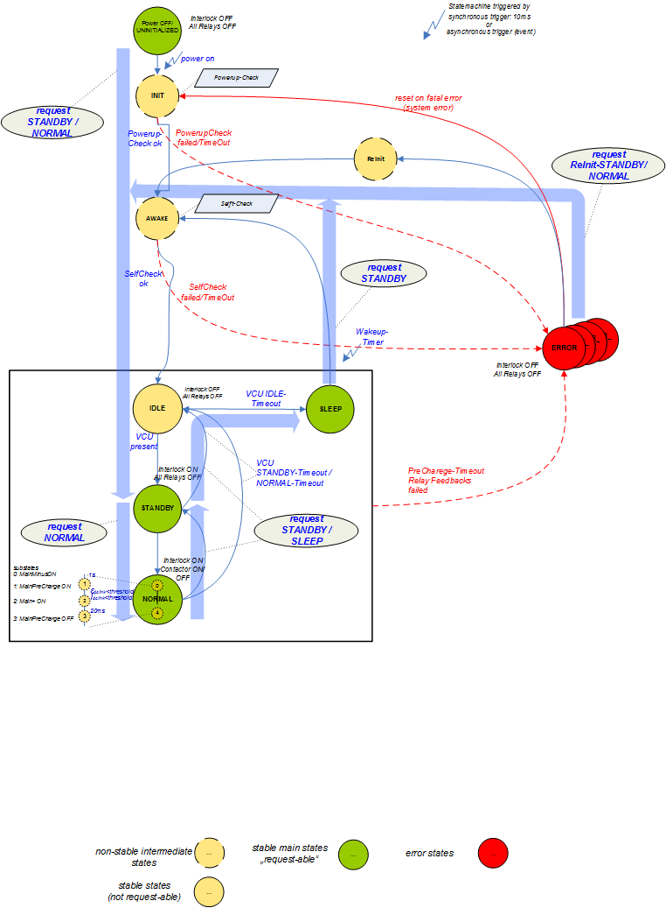

.. include:: ../../../macros.rst

.. _SYSCTRL:

==============
System Control
==============

.. highlight:: C

SYS Control (|mod_sysctrl|) handles states request from BMS Control (|mod_bmsctrl|) or error requests from the Diagnosis Module (|mod_can|). System Control drives the contactors via the |mod_contactor|.

Included Files
~~~~~~~~~~~~~~

Driver:
 - ``src\\engine\\syscontrol.c``
 - ``src\\engine\\syscontrol.h``
 
Driver Configuration:
 - ``src\\engine\\config\\syscontrol_cfg.c``
 - ``src\\engine\\config\\syscontrol_cfg.h``

Dependencies
~~~~~~~~~~~~

Contactor
 - ``src\\module\\config\\contactor_cfg.c``
 - ``src\\module\\config\\contactor_cfg.h``

Database
 - ``src\\engine\\config\\database_cfg.c``
 - ``src\\engine\\config\\database_cfg.h``
 

Diagnosis
 - ``src\\engine\\config\\diag_cfg.c``
 - ``src\\engine\\config\\diag_cfg.h``
 - ``src\\engine\\config\\diag_id.h``

Detailed Description of SYSCTRL
~~~~~~~~~~~~~~~~~~~~~~~~~~~~~~~

:numref:`Fig. %s <sysctrl_figure1>` shows the organization of the Syscontrol statemachine.

.. _sysctrl_figure1:

   System Control state machine

Description of States
---------------------

The main states of the statemachine are:

+-----+-----------------------------------+-----------------------------------------------------------------------------------------------+
| Nr. | State                             | Description                                                                                   |
+=====+===================================+===============================================================================================+
| 1   | ``SYSCTRL_STATE_UNINITIALIZED``   | Initial state at startup.                                                                     |
+-----+-----------------------------------+-----------------------------------------------------------------------------------------------+
| 2   | ``SYSCTRL_STATE_INITIALIZING``    | First state that is requested after startup. Does basic startup checks, e.g. checking if the  |
|     |                                   | contactors can be opened.                                                                     |
+-----+-----------------------------------+-----------------------------------------------------------------------------------------------+
| 6   | ``SYSCTRL_STATE_AWAKE``           |                                                                                               |
+-----+-----------------------------------+-----------------------------------------------------------------------------------------------+
| 7   | ``SYSCTRL_STATE_SLEEP``           |                                                                                               |
+-----+-----------------------------------+-----------------------------------------------------------------------------------------------+
| 8   | ``SYSCTRL_STATE_IDLE``            |                                                                                               |
+-----+-----------------------------------+-----------------------------------------------------------------------------------------------+
| 9   | ``SYSCTRL_STATE_NORMAL``          | Main contactors are closed.                                                                   |
+-----+-----------------------------------+-----------------------------------------------------------------------------------------------+
| 17  | ``SYSCTRL_STATE_ERROR``           | Can be accessed from every other state. Opens the  interlock at software side.             |
|     |                                   | (and in consequence at he hardware) and all contactors.                                       |
+-----+-----------------------------------+-----------------------------------------------------------------------------------------------+
| 18  | ``SYSCTRL_STATE_PRECHARGE_ERROR`` | Opens all contactors but not the interlock.                                                   |
+-----+-----------------------------------+-----------------------------------------------------------------------------------------------+
| 20  | ``SYSCTRL_STATE_STANDBY``         |                                                                                               |
+-----+-----------------------------------+-----------------------------------------------------------------------------------------------+

Procedure in State NORMAL
-------------------------

.. note::

		If the normal state (``SYSCTRL_STATE_NORMAL``) is left in the statemachine, it has to be ensured that the contactors are opened in the next state.

Procedure in normal state:
Check if interlock line is still closed. If not, open interlock and contactors at software side to be in line with the hardware.

If the interlock is closed, the following procedure is performed:

1. close minus main contactor, then wait and go to 2

2. check if main minus contactor is closed

  1. if minus main contactor is closed: go to 3
  2. if minus main contactor open and timeout reached: exit to error state
  
3. close plus precharge contactor and wait and go to 4
4. check if plus precharge contactor is closed

  1. if plus precharge contactor is closed: go to 5
  2. if open and timeout reached: exit to error state
  
5. loop and check precharge end conditions (U diff < threshold, I < threshold)

  a. precharge end condition OK: close plus main contactor and wait and go to 6
  b. precharge end condition BUSY (means waiting): wait if timer has not elapsed, else go to error state
  
6. open plus precharge contactor and go to 7
7. check if plus main contactor is closed

  1. if plus main contactor is closed: go to 8
  2. if open and timeout reached: exit to error state
  
8. continuous check if main plus and main minus is closed

  1. if plus main or minus main contactor open: exit to error state
  2. if plus main and minus main contactor open closed: go to 8 (loop)

:numref:`Fig. %s <sysctrl_figure2>` shows the detailed sequence of the normal state of the Syscontrol statemachine.

.. _sysctrl_figure2:
.. figure:: SYSCTRL_detailedNormal.png
   :width: 100 %

   Detailed view of SysControl state NORMAL

SYSCTRL Configuration
~~~~~~~~~~~~~~~~~~~~~

.. Default Configuration
.. ---------------------

The configuration of timeouts, thresholds etc. is done in ``syscontrol_cfg.h``. All configurations are accessible with |foxygen|. The macros of the contactor module are mapped to ``syscontrol`` macros. Finally new macros for switching the contactors are introduced.

Usage
~~~~~

Initialization
--------------

The statemachine is initialized by ``SYSCTRL_Trigger(SYS_MODE_CYCLIC_EVENT)`` and the starting point of the syscontrol state machine is ``SYSCTRL_STATE_UNINITIALIZED``. In this state the contactor initialization is called, and checks if all contactors are open.

Functions
---------

``static void SYSCTRL_StateControl(void)`` performs the state transitions with all needed sub-steps between the states. It is important to know, that when entering the error state (``SYSCTRL_STATE_ERROR`` or ``SYSCTRL_STATE_PRECHARGE_ERROR``) the contactors have to be opened manually by using the macro ``SYSCTRL_ALL_CONTACTORS_OFF()``; Therefore, if the user adds another error, this macro should be called in the added error state. For the other states it is referred to the |doxygen| documentation.
 